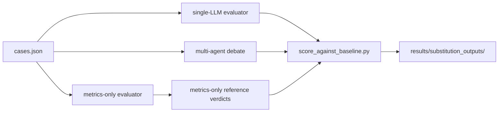

# Phase 2 Overview - Substitution Feasibility

> *Team reference for the Phase 2 evaluation direction: the pivot from
> label-agreement evaluation toward substitution scoring against the metrics-only
> reference system.*

---

## Where Phase 2 Fits

Phase 1 built the full counterfactual evaluation stack:

```text
ML training
  -> DiCE counterfactual generation
  -> deterministic metrics and heuristics
  -> cases.json bridge
  -> metrics-only / single-LLM / multi-agent evaluation
```

The five Phase 1 walkthrough files remain the architectural reference for that
pipeline:

- [Session 1 - ML Foundations](../session_01_ml_foundations.md)
- [Session 2 - Inference & DiCE Counterfactual Generation](../session_02_inference_and_dice_generation.md)
- [Session 3 - Deterministic Evaluation Foundations](../session_03_deterministic_evaluation_foundations.md)
- [Session 4 - Bridge & Deterministic Baseline](../session_04_bridge_and_baseline.md)
- [Session 5 - The LLM Evaluation Layer](../session_05_llm_evaluation_layer.md)

Phase 2 changes the evaluation framing, not the underlying pipeline.

The pivot is motivated by the methodology review:

- [Evaluation Methodology Review - 2026-05-17](../../methodology/evaluation_methodology_review_2026-05-17.md)

In Phase 1, we scored the three systems against team-drafted reference labels in
`annotations/ground_truth_labels.json`. That was useful for diagnosing failure
modes, but it also created a defensibility problem: the same team designed the
heuristics and drafted the labels. The metrics-only system was therefore being
judged against a reference artifact that was naturally close to its own logic.

Phase 2 reframes the question.

Instead of asking:

```text
Do LLM systems add value over deterministic rules?
```

we now ask:

```text
How closely can LLM and multi-agent systems substitute the deterministic
reference, and at what cost?
```

The metrics-only baseline becomes the **reference system** for substitution
scoring. Single-LLM and multi-agent outputs are measured by how closely they
approximate that structured reference.

Terminology matters here:

```text
reference system != ground truth
```

The metrics-only reference is treated as the scoring anchor for this Phase 2
experiment. It is not an external truth source and should not be described that
way. In code, comments, tables, and report text, we use terms such as reference
system, metrics-only reference, deterministic reference, reference benchmark,
or structured baseline.

We keep the existing annotation file name for backward compatibility, but Phase
2 scoring does not depend on treating that file as the main comparison target.



---

## Change 1 - `count_diversity_low`

Phase 2 adds one metric warning to the metrics-only reference:

```python
"count_diversity_low": 0.2
```

The emitted warning is:

```text
low_count_diversity
```

This warning is derived from `metrics.count_diversity`, the case-level metric
that measures how different the counterfactuals are from each other in terms of
changed feature count.

Conceptually, low count diversity means the user receives little real variety.
DiCE may output four counterfactuals, but if the four are minor variants of the
same intervention, the user effectively gets one piece of advice, not four.

This matters because DiCE is configured with a strong diversity weight:

```python
diversity_weight = 5.0
```

That weight pushes the optimizer to search for varied recourse paths. If the
final output still has low count diversity, the warning is informative: the
search was asked to find diversity but could not produce enough distinct paths
for that individual under the active constraints.

This remains a **metric warning**, not a scored taxonomy label.

The distinction is the same as in Phase 1: scored issue labels live in
`flagged_issues`, while metric warnings live in `metric_warnings`. Metric
warnings can affect severity and rationale, but they are not part of the issue
taxonomy and are not counted as labels during issue-set substitution scoring.

This keeps the taxonomy focused on qualitative recourse problems while still
letting the deterministic reference surface weak quantitative behavior.

---

## Change 2 - Removing `inconsistent_work_profile`

Phase 2 removes `inconsistent_work_profile` from the scored issue taxonomy.

The reason is empirical and methodological. The heuristic condition was very
narrow: it only fired for direct nonworking-workclass contradictions such as
`Without-pay` or `Never-worked` paired with an active occupation, or the
symmetric situation where a nonworking workclass remained while occupation was
introduced.

That condition never fired on the current 10-case sample.

At the same time, LLM systems repeatedly hallucinated the label from ordinary
workclass or occupation changes. Even after prompt narrowing, the label stayed
attractive to the models because it sounded semantically plausible. This created
a noisy label: deterministic rules almost never supported it, while LLMs kept
adding it.

For Phase 2, the taxonomy is reduced to five scored labels:

1. `extreme_working_hours`
2. `implausible_time_dependent_change`
3. `unactionable_capital_shift`
4. `too_many_changes`
5. `fragile_counterfactual`

The removal is reflected in the four-way taxonomy sync:

- `src/agents/prompts.py`
- `src/policy/heuristics.py`
- `src/evaluators/metrics_only.py`
- `annotations/ground_truth_labels.json`

The old label can return later, but not in its previous ambiguous form. The
likely future direction is to split it into two explicit symmetric signals:

- `workclass_changed_to_nonworking`
- `occupation_set_against_nonworking_workclass`

Those names are not final. The important point is that any future work-profile
signal should encode the deterministic condition directly and avoid inviting
broad semantic inference.

---

## Change 3 - Substitution Scoring

Phase 2 adds:

```text
scripts/score_against_baseline.py
```

The script compares LLM-based evaluators against the metrics-only reference
system. It reads:

```text
results/metrics_only_outputs/metrics_only_latest.json
results/debate_outputs/<model-slug>_single_llm_latest.json
results/debate_outputs/<model-slug>_multi_agent_latest.json
```

If a single-LLM or multi-agent latest file is missing, the script logs a warning
and scores whichever system is available.

Outputs are written to:

```text
results/substitution_outputs/substitution_scores_<timestamp>.json
results/substitution_outputs/substitution_scores_latest.json
```

The output contains:

- a summary per evaluated system;
- per-case reference issue sets;
- per-case missed issues;
- per-case extra issues;
- exact-match flags;
- agreement on `overall_assessment`;
- agreement on `severity`;
- agreement on `recommended_action`.

The central issue-set metrics use the same **Phase 1 vocabulary**
(precision / recall / F1) as the legacy ground-truth scorer, so substitution
scoring and ground-truth scoring report the same labels. Each reference issue
label is treated as the positive class:

| Metric | Meaning |
|---|---|
| `recall` | Of the issue labels flagged by the reference, the percentage the LLM system also flagged. (This was previously called `detection_rate`.) |
| `precision` | Of the issue labels the LLM system flagged, the percentage that the reference also flagged. (Replaces the older per-case `false_positive_rate`.) |
| `f1` | Harmonic mean of `precision` and `recall`. |
| `exact_match_rate` | Percentage of cases where the LLM issue set exactly equals the reference issue set. |

The summary also reports the raw `true_positives`, `false_positives`, and
`false_negatives` label counts behind those rates.

The schema-level agreement metrics are:

| Metric | Meaning |
|---|---|
| `assessment_agreement` | Same `overall_assessment` as the reference. |
| `severity_agreement` | Same `severity` as the reference. |
| `recommended_action_agreement` | Same `recommended_action` as the reference. |

Example invocation:

```powershell
$env:PYTHONPATH="src"; python scripts/score_against_baseline.py
```

Because the historical LLM latest files were produced before the Phase 2
taxonomy reduction, they may still contain removed labels. In substitution
scoring, those labels appear as `extra_issues` relative to the new five-label
reference. That is expected and useful: it shows where a historical LLM run is
out of sync with the current reference taxonomy.

Case-by-case disagreement analysis remains important. The deterministic
reference is a structured benchmark, not a perfect oracle. When the single-LLM
misses an issue or adds one, we should inspect the case manually: the prompt may
have failed, the LLM may have ignored evidence, or the deterministic heuristic
may be too rigid. The LLM verdict rationale and explicit reasoning are therefore
part of the evaluation surface, not just decoration.

---

## What Stays The Same

Phase 2 does not change the ML pipeline.

The following parts remain authoritative as documented in the Phase 1
walkthroughs: Adult dataset loading and target encoding, Logistic Regression
for DiCE compatibility, full sklearn pipeline persistence, DiCE `genetic`
counterfactual generation, long-term actionable feature policy, per-instance
permitted ranges, deterministic heuristic evidence, `cases.json` as the bridge
artifact, Groq-only LLM execution through AutoGen, and the shared Judge-style
verdict schema.

The methodology review remains the canonical document for why the pivot
happened:

- [Evaluation Methodology Review - 2026-05-17](../../methodology/evaluation_methodology_review_2026-05-17.md)

Phase 2 adds a new interpretation layer on top of the existing system. It does
not invalidate the pipeline architecture.

---

## Open Questions

1. Should the `count_diversity_low = 0.2` threshold ever be recalibrated? The
   current value is fixed for Phase 2, and recalibration would define a new
   experimental condition.

2. Should work-profile plausibility return as two explicit signals? The removed
   label was too broad for LLM prompts and too narrow in the heuristic.

3. How much does model size affect substitution feasibility? The methodology
   review treats the 8B versus 70B question as a separate experiment.

4. Should substitution scoring become the main reported table? For Phase 2, yes:
   the active question is substitution fit against the deterministic reference.
