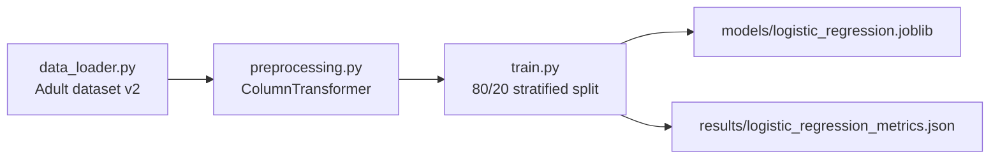
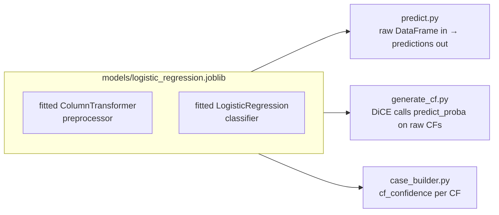

# Session 1 — ML Foundations

> *Reference doc for any team member picking up the ML layer cold. Covers how raw data enters the project, how it's shaped into model-ready inputs, and why the project ships the classifier it does.*

---

## Where this session fits

The project has three high-level layers:

```
ML Pipeline (src/pipeline/)  →  Bridge (case_builder.py)  →  Evaluation
train → predict → generate_cf       CSV/JSON → cases.json       metrics-only baseline
                → cf_metrics                                    or AutoGen single/multi-agent
```

Session 1 covers the bottom of the stack — everything before counterfactual generation begins. Three modules:

1. `src/pipeline/data_loader.py` — load and label-encode the Adult Income dataset.
2. `src/pipeline/preprocessing.py` — turn raw mixed-type rows into model-ready vectors.
3. `src/pipeline/models.py` + `src/pipeline/train.py` — define and train the classifier.

This session establishes three design decisions worth defending in any review:
- Why this dataset, in this version, with this target encoding.
- Why each preprocessing choice (median imputation, one-hot encoding with unknown-ignore, standard scaling).
- Why the project ships Logistic Regression even though XGBoost was more accurate.



---

## 1. The Dataset — `src/pipeline/data_loader.py`

One function, intentionally small:

```python
def load_adult_dataset():
    adult = fetch_openml(name="adult", version=2, as_frame=True)
    X = adult.data.copy()
    y = adult.target.copy()
    y = y.map({"<=50K": 0, ">50K": 1})
    return X, y
```

The centralization matters more than its brevity. If multiple files loaded the dataset with subtly different conventions, downstream bugs would become impossible to trace.

**About the dataset.** The Adult Income dataset (a.k.a. "Census Income") is the canonical fairness-testing tabular dataset:

| Property | Value |
|---|---|
| Source | OpenML, version 2 (48,842 rows; concatenated UCI train + test) |
| Task | Binary classification |
| Target | Does the individual earn more than $50K/year? |
| Features | 14 mixed-type (continuous + categorical) |
| Class distribution | ~76% ≤50K (class 0), ~24% >50K (class 1) |

**Class imbalance shapes everything downstream.** Roughly 3 out of 4 individuals earn ≤50K. A model that always predicts "≤50K" scores 76% accuracy and is useless — so precision, recall, F1, and the confusion matrix all matter here. The imbalance also makes the majority class the natural pool for CF generation: `predict.py` filters `prediction == 0` to collect unfavorable cases, and there are plenty of them.

**The target encoding is a project-wide convention.** `<=50K → 0` and `>50K → 1` propagates through the entire codebase: `generate_cf.py` sets `DESIRED_CLASS = 1`, and every LLM prompt assumes "1 = favorable, 0 = unfavorable" semantics. Flipping this mapping would silently break interpretation everywhere without raising an exception — the model would just learn the inverse, but every downstream artifact would misrepresent what it means.

**Versioning matters for reproducibility.** OpenML has multiple `adult` dataset versions with different cleaning and row counts. The project pins version 2 (48,842 rows). The DiCE paper (Mothilal et al., 2020) uses the UCI training split only (~32,561 rows), so accuracy numbers are not directly comparable. Metric ranges (proximity, sparsity, diversity) are interpretation-comparable because they're relative to distribution, not absolute values — but this should be flagged explicitly in the methodology section of the report.

The alternatives not taken: German Credit / COMPAS / Bank Marketing were all considered. Adult is the de-facto standard in the CF literature, keeping results comparable to other papers. Loading from a local CSV would be marginally more reproducible; OpenML caches locally after first fetch. Returning numpy arrays instead of pandas would lose feature names, which are required everywhere downstream.

---

## 2. Preprocessing — `src/pipeline/preprocessing.py`

Classifiers consume numerical matrices of fixed shape. The Adult dataset arrives as a `DataFrame` with strings (`workclass = "Private"`), integers (`age = 35`), floats, and missing values encoded as `"?"`. The preprocessing layer solves three problems:

1. **Missing values** — `"?"` markers in categorical columns.
2. **Categorical → numeric** — the model needs numbers.
3. **Numerical scaling** — Logistic Regression's optimizer requires features on comparable scales.

The module returns an **unfitted** `ColumnTransformer`:

| Branch | Steps |
|---|---|
| **Numerical** (`age`, `hours-per-week`, `capital-gain`, …) | `SimpleImputer(strategy="median")` → `StandardScaler()` |
| **Categorical** (`workclass`, `occupation`, …) | `SimpleImputer(strategy="most_frequent")` → `OneHotEncoder(handle_unknown="ignore")` |

Fitting happens inside `train.py`, after the train/test split. This enforces the "fit on train, transform on everything" rule and prevents data leakage.

**`strategy="median"` for numerical imputation.** `capital-gain` is the deciding feature. Most people have $0; a small minority have very large values (up to the dataset-encoded cap of $99,999). The mean is dragged up by those outliers — imputing with it would invent a wealthier population than reality. The median for `capital-gain` is 0, which is faithful. Several other Adult features are similarly skewed (`capital-loss`, `hours-per-week` to a lesser extent), so median wins across the board.

**`strategy="most_frequent"` for categorical imputation.** Missingness in Adult is concentrated in `workclass` and `occupation` and appears roughly at-random — mode imputation is appropriate when missingness isn't informative. If missingness were correlated with the target, switching to a constant `"missing"` category would be the right call; there's no current evidence for that.

**`handle_unknown="ignore"` is load-bearing, not a defensive nicety.** The encoder learns its OHE vocabulary at fit time. At transform time, the default `"error"` behavior raises `ValueError` on any unseen category. With `"ignore"`, an unseen category is encoded as all-zeros in its one-hot block. Two pipeline-specific reasons this is required:

- `predict.py` runs on all 48,842 rows including the 20% held-out test set; a rare category present only in test would crash prediction.
- `generate_cf.py` lets DiCE propose new feature values. Any edge case during CF generation would crash the entire run.

**`StandardScaler` and Logistic Regression's optimizer.** With `age ∈ [17, 90]` and `capital-gain ∈ [0, 100,000]`, an unscaled gradient is dominated by capital-gain — the optimizer zigzags instead of converging cleanly. Scaling to mean 0, std 1 puts all features on equal footing. L2 regularization is also fairly applied after scaling. Tree-based models don't need this because they split on thresholds, and absolute scale doesn't affect partitioning.

**Alternatives not taken:**

| Alternative | Why not |
|---|---|
| `TargetEncoder` | Leaks target info; overkill for low-cardinality categoricals. |
| `RobustScaler` | `median + StandardScaler` is already outlier-robust enough. |
| `MinMaxScaler` | Doesn't improve convergence as much; mainly useful for bounded-output models. |
| Dropping NaN rows | Wasteful (~7% of data). |

**Downstream implications.** The fitted preprocessor is baked into the saved joblib pipeline alongside the classifier. `predict.py` and `generate_cf.py` can therefore pass raw `DataFrame`s with strings and `"?"` markers — the loaded pipeline handles them. DiCE proposes CFs in the raw feature space; preprocessing handles OHE and scaling internally. The OHE vocabulary is frozen at fit time, which is exactly why `handle_unknown="ignore"` is required for any unusual value DiCE proposes. A subtle consequence: renaming any source column upstream breaks the loaded model, because the fitted `ColumnTransformer` remembers column names and positions.

---

## 3. Model & Training — `src/pipeline/models.py` + `src/pipeline/train.py`

### The classifier choice

This is the most consequential design decision in the project, and it has nothing to do with accuracy.

`src/pipeline/models.py` is six lines. It returns a `(name, estimator)` tuple:

```python
return "logistic_regression", LogisticRegression(max_iter=1000, random_state=42)
```

The minimalism is intentional — this is the one-line policy for "which classifier this project uses". `max_iter=1000` is not a hyperparameter tuning call. After OHE, the model trains in a ~106-dimensional space (`native-country` alone has 41 levels). The sklearn default `max_iter=100` reliably fails to converge there, producing a `ConvergenceWarning` and subtly wrong coefficients. 1000 iterations buys guaranteed convergence at negligible compute cost.

### Why Logistic Regression and not XGBoost

Earlier experiments had XGBoost slightly outperforming LR on every classification metric. The project ships LR anyway. The reason is DiCE.

DiCE searches the feature space for counterfactuals that flip the model's prediction. It supports three search methods:

| Method | Requires | Speed | Quality |
| --- | --- | --- | --- |
| `gradient` | Differentiable model (Keras / PyTorch) | Fast | Excellent |
| `genetic` | Any model with `predict_proba` | Medium | Good |
| `random` | Same as genetic | Very fast | Poor (no diversity guarantee) |

`gradient` is off the table for sklearn. `random` produces unstructured results with no diversity guarantee. The project uses `genetic`.

`genetic` does evolutionary search guided by `predict_proba`. It works best on a **smooth probability surface** — small feature changes should produce small, predictable probability changes. Logistic Regression delivers exactly that: a sigmoid over a linear combination is smooth and monotonic everywhere.

XGBoost's probability surface is **piecewise-constant with sharp cliffs**, because it's a sum of step functions over thousands of tree splits. The genetic algorithm spends most of its time on plateaus of identical probability before stumbling onto a cliff that flips the prediction. The CFs it finds tend to be less actionable (large jumps to cross thresholds), less diverse (concentrated near a handful of cliff edges), and less reproducible (small input perturbations yield different CFs because cliffs are nearby).



The trade-off summarized:

| Property | XGBoost | Logistic Regression |
|---|---|---|
| Accuracy | ~87% | ~85% |
| Model interpretability | Black box | Coefficients = direct feature importance |
| CF quality (sparsity, plausibility) | Worse | Much better |
| CF generation speed (genetic) | Slow + flaky | Fast + stable |

The project traded ~2% accuracy for dramatically better CF generation. This is defensible because the research question is about the quality of explanations and their evaluation — not about building the best classifier. The defense to articulate in any review: *"The project's contribution is the multi-agent evaluation layer. We need a model that produces clean explanations to evaluate, not the most accurate possible classifier."*

Other alternatives considered:

| Alternative | Why not |
|---|---|
| **XGBoost** | Piecewise decision surface degrades genetic CF search. |
| **Random Forest** | Smoother than XGBoost due to vote-averaging, but still piecewise; doesn't fully solve the problem. |
| **Neural net** | Would unlock DiCE's `gradient` method, but typically worse accuracy on tabular data, plus training infrastructure overhead. |
| **Linear SVM** | Equivalent to LR in spirit, but `predict_proba` requires Platt scaling — extra step, no gain. |

### The training script

`train.py` does six things in order:

1. Load the dataset via `data_loader.py`.
2. Apply the feature policy — drop `education` from model inputs (it duplicates `education-num`; full coverage in Session 2).
3. Stratified 80/20 train/test split — preserves the 76/24 class balance in both halves.
4. Build the sklearn `Pipeline(preprocessor + classifier)`.
5. Fit on training data — the preprocessor learns its medians, modes, and OHE vocabulary; the classifier learns its coefficients.
6. Evaluate and save — write `models/logistic_regression.joblib` and `results/logistic_regression_metrics.json`.

**Why save the full pipeline, not just the classifier weights.** If only the classifier were saved, the preprocessor would need to be refit on every load — expensive, and wrong, because refitting on the inference set leaks information. The full pipeline bundle means every downstream consumer (`predict.py`, `generate_cf.py`, `case_builder.py`) calls `joblib.load(...).predict(X_raw)` or `predict_proba(X_raw)` on raw DataFrames without needing to know about OHE or scaling internals.

Three places in the codebase hard-code the LR artifact path: `predict.py`, `generate_cf.py`, and `case_builder.py` (which reads `results/logistic_regression_metrics.json` for the `model_info` block in each case). Any classifier migration touches all three paths and likely requires reconsidering the DiCE method as well.

---

## Key takeaways

The dataset is fixed: OpenML `adult` version 2, 48,842 rows, target encoded as `<=50K → 0` and `>50K → 1`. That encoding is a project-wide convention — flipping it would silently invert interpretation in every downstream artifact.

Preprocessing handles three problems: missing values (median for numerical, most-frequent for categorical), type conversion (one-hot with `handle_unknown="ignore"`), and scale normalization (StandardScaler). The `handle_unknown="ignore"` flag is not optional — without it, predict-time and CF-generation-time crashes on unseen categories are guaranteed.

The full sklearn `Pipeline` is saved as a single joblib artifact, bundling the fitted preprocessor and classifier together. This is what allows DiCE, `predict.py`, and `case_builder.py` to consume raw DataFrames without touching encoding internals.

The most important design choice in the whole project: Logistic Regression over XGBoost, sacrificing ~2% classification accuracy for a smooth probability surface that makes DiCE's `genetic` CF search stable, diverse, and actionable. The project is not about building the best classifier — it's about evaluating explanations. Clean explanations require a clean decision boundary to search against.

## Files referenced in this session

- [src/pipeline/data_loader.py](../../src/pipeline/data_loader.py)
- [src/pipeline/preprocessing.py](../../src/pipeline/preprocessing.py)
- [src/pipeline/models.py](../../src/pipeline/models.py)
- [src/pipeline/train.py](../../src/pipeline/train.py)
- [src/policy/feature_policy.py](../../src/policy/feature_policy.py) (only the `select_model_features` call used by `train.py`; full coverage in Session 3)
