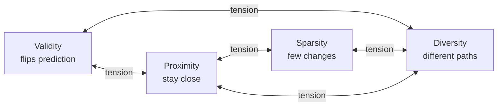
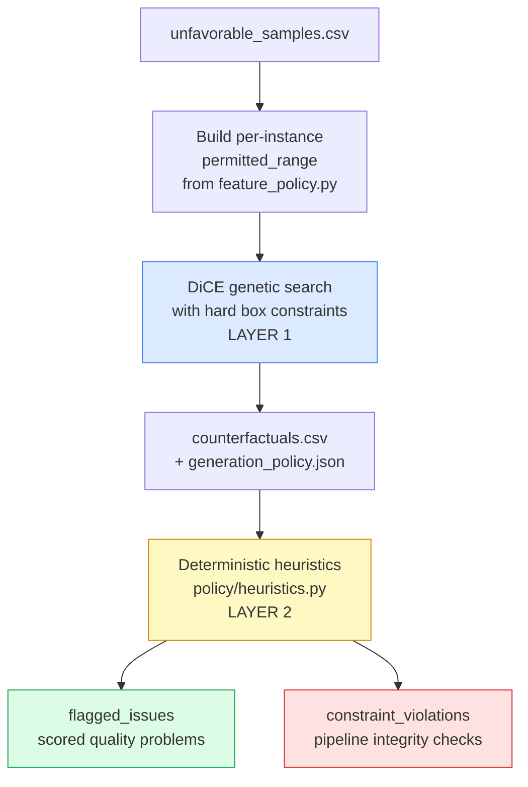

# Session 2 — Inference & DiCE Counterfactual Generation

> *Team reference doc. Covers individual selection, counterfactual theory, DiCE configuration, and the two-layer recourse policy. Dense — this is the busiest session in the pipeline.*

---

## Where this session fits

Session 1 covers training the classifier. Session 2 covers using it: every individual is scored, a pool of unfavorable predictions is isolated, and DiCE generates counterfactual explanations for them under a principled recourse policy.

Two modules carry this work:

- `src/pipeline/predict.py` — samples unfavorable individuals and tags false negatives.
- `src/pipeline/generate_cf.py` + `src/policy/feature_policy.py` — generates counterfactuals via DiCE under empirical box constraints.

By the end of this document, three design decisions should be defensible in any review:

- Why the pipeline filters on **predicted** unfavorable rather than **truly** unfavorable.
- Why DiCE's **genetic** method is the right choice here, and what each weight controls.
- The **two-layer recourse policy** — empirical box constraints during generation, deterministic heuristics post-hoc — and why the redundancy between those layers is intentional.

---

## 1. Sampling Unfavorable Individuals — `src/pipeline/predict.py`

Counterfactual explanations are only meaningful for individuals who received an unfavorable prediction. If the model says ">50K", there is no recourse question to ask. `predict.py` runs the trained model on the full 48,842-row dataset, isolates predicted-unfavorable individuals, and samples 10. It also attaches one piece of metadata that threads through everything downstream: the **false-negative flag**.

The sampling flow:

1. Load `models/logistic_regression.joblib`.
2. Score the full dataset.
3. Filter rows where `prediction == 0` (predicted ≤50K).
4. Drop rows with `"?"` markers (coerced to NaN, then dropped).
5. Sample 10 individuals with `random_state=42`.
6. Tag each as `is_false_negative = (prediction == 0) AND (true_label == 1)`.
7. Save to `results/unfavorable_samples.csv`.

### Why *predicted* unfavorable, not *truly* unfavorable

The instinct is to filter on ground-truth income (help people who actually earn ≤50K). That misframes the project. The goal is to audit **the explanations the model produces for the people it labels as ≤50K** — not to audit income reality.

The model's prediction is what any user of the model would see. If the model misclassifies someone — a false negative: actually earns >50K, but the model says ≤50K — that person still receives the unfavorable outcome and still gets a counterfactual. Whether that counterfactual is meaningful is a separate, important question. So the filter is `prediction == 0`, and the downstream multi-agent debate is auditing the explanation surface the model exposes.

### The false-negative flag

`is_false_negative` marks cases where the model was wrong about the person. The CF for such a case is generated against the model's decision boundary, not against any real distributional boundary — which is a much weaker statement than "what would meaningfully push this person into the higher-earning class."

The flag is **not** added to `flagged_issues` in any verdict. It lives in `reasoning_summary` instead. A `flagged_issue` is a quality problem with the CF; a false negative is a quality problem with the underlying prediction. Mixing the two would muddy the verdict's semantics. The flag is a context modifier that conditions interpretation, not a quality verdict on the CF itself.

### Sample size

`SAMPLE_SIZE = 10` is a quota decision, not a statistical one. Each individual receives 4 counterfactuals. Each case becomes a JSON prompt of several thousand tokens, distributed across four agents and multiple debate rounds. Groq's free-tier limits for `llama-3.1-8b-instant` are 30 RPM, 6K TPM, 14.4K RPD, and 500K TPD. A single multi-agent run can spike 4–6K tokens per case. With 70-second inter-turn pacing, 10 cases takes ~30 minutes and stays within daily limits.

Critically, the same 10 cases need to be evaluated three times (metrics-only, single-LLM, multi-agent) and re-run whenever prompts or thresholds change. For *qualitative comparison of three evaluation systems*, 10 cases is appropriate — the claim isn't about generalization, it's about how the systems behave side by side on identical inputs.

### Downstream implications

`original_index` (position 0–9 in the CSV) becomes the join key through the entire artifact chain: `counterfactuals.csv`, `cf_metrics_per_instance.csv`, `cases.json`. The `is_false_negative` flag propagates through all of them, appearing in every LLM prompt and in the metrics-only verdict's severity calculation. Changing `SAMPLE_SIZE` triggers a cascade — rate-limit pacing in `run_debate.py`, expected runtime, and possibly the number of CFs per individual.

On NaN handling: dropping missing values at this stage guarantees that `generate_cf.py` only ever sees clean rows. Any NaN appearing later is unambiguously a generation artifact, not an input problem.

### Alternatives considered

| Alternative | Why discarded |
|---|---|
| Stratified sampling by demographic | Better demographic coverage but introduces selection bias; blind random sampling is the honest baseline. |
| Sampling from both favorable and unfavorable | Out of scope; recourse only applies to denied outcomes. |
| Hand-picking interesting cases | Biases the experiment. Random with fixed seed is the principled choice. |
| Over-sampling false negatives | Conflates "are CFs good?" with "are CFs good for misclassified people?"; cleaner to keep the flag as context. |

---

## 2. Counterfactual Generation — `src/pipeline/generate_cf.py` + `src/policy/feature_policy.py`

This is the densest module in the project. Five concepts to work through: what a CF is, what DiCE does, the genetic method's parameters, the actionable feature policy, and the two-layer recourse model.

### 2.1 What a counterfactual explanation is

A counterfactual explanation answers: *what is the smallest, most plausible change to this individual's features such that the model's prediction flips?*

It's a contrastive form of explanation. Instead of "the model predicted ≤50K because of feature X", it says: *"if X and Y had different values, the model would have predicted >50K."* That's more actionable for the person who received the decision — it tells them what they could **do**, not just why the system decided.

But the definition already contains a tension. A good CF should be:

- **Valid** — actually flips the prediction.
- **Proximate** — small changes only; stay close to the original.
- **Sparse** — touch few features.
- **Diverse** — multiple CFs per individual should offer genuinely different paths, not slight variations of the same move.
- **Plausible** — the changes must be realistic. "If you were 70 with a PhD, the model would say >50K" is technically valid and completely useless.



Maximum validity is trivial: push `capital-gain` to $1M and the model flips. But that's neither sparse nor proximate nor plausible. CF generation is optimization under competing objectives, and every CF generator is essentially a configuration of weights across those objectives.

### 2.2 DiCE and why genetic is the right method

DiCE (Diverse Counterfactual Explanations, Mothilal et al., 2020) takes a model, an instance, a desired class, a list of features allowed to vary, and optional per-feature box constraints — and searches for a **set** of counterfactuals (not just one) that jointly score well on validity, proximity, sparsity, and diversity. The diversity goal is what makes DiCE distinctive: the framing is *"here are several different ways this person could change; pick the one that fits your situation."*

| Method | Mechanism | Status |
|---|---|---|
| `gradient` | Backprop on a differentiable model | Requires Keras/PyTorch — off the table for sklearn. |
| `genetic` | Evolutionary search: population, fitness, mutation, crossover | Any model with `predict_proba`. **Used here.** |
| `random` | Sample random perturbations, keep those that flip | Too unstructured; no quality guarantees. |

`genetic` is chosen because it's the best available option given the sklearn logistic regression classifier, and because it exposes explicit control over all four objectives through its weight parameters.

### 2.3 The DiCE weight configuration

These constants live in `feature_policy.py` — they're project-level recourse policy, not generic DiCE defaults:

```python
proximity_weight       = 0.2     # keep CFs close to the original
sparsity_weight        = 0.2     # prefer fewer feature changes
diversity_weight       = 5.0     # strongly prefer CFs that differ from each other
categorical_penalty    = 0.1     # small cost for categorical changes
stopping_threshold     = 0.5     # accept a CF the moment it crosses the decision boundary
posthoc_sparsity_param = 0.1     # post-search: prune low-impact feature changes
```

**`diversity_weight = 5.0`** is far above the others by design. Without strong pressure, DiCE's population homogenizes around one "good" region of feature space. The project explicitly fights that to get genuinely different recourse paths. Reducing this weight would yield cleaner individual CFs but a more redundant set.

**`stopping_threshold = 0.5`** accepts CFs that barely flip — `predict_proba(class=1) > 0.5` is sufficient. This is exactly why the `fragile_counterfactual` heuristic exists downstream. A CF with confidence 0.51 is one feature-noise away from flipping back. The deterministic heuristics flag this; the agents debate it.

**`posthoc_sparsity_param = 0.1`** is a cleanup pass. After genetic search produces a candidate, DiCE walks back and tries to un-change features whose contribution to the flip is small. The genetic algorithm tends to be greedy; this step improves sparsity without sacrificing validity.

**`TOTAL_CFS = 4`** per instance: enough to support diversity metrics (pairwise diversity is meaningful at K ≥ 2; at K = 4 there are 6 pairs), not so many that the LLM token budget gets blown.

There is no deep theory behind the specific weight values — they are DiCE's recommended genetic defaults, kept stable. Sweeping them and observing how multi-agent verdicts shift is a natural extension.

### 2.4 The actionable feature list

DiCE only changes features in `features_to_vary`:

```
age, education-num, workclass, occupation, hours-per-week, capital-gain, capital-loss
```

Everything else — `fnlwgt`, `marital-status`, `relationship`, `race`, `sex`, `native-country` — is frozen.

**`race`, `sex`, `native-country`** are protected attributes. Generating a CF that says "if you were a different race, the model would predict >50K" is precisely the fairness violation the project aims to *detect*, not *propose*. Recourse on these features is meaningless ("change your race") and morally wrong regardless.

**`marital-status`, `relationship`** are personal and not realistically actionable as recourse. Frozen by convention.

**`fnlwgt`** is a census sampling weight — a number the Census Bureau assigns to indicate how many real people a row represents. Mutating it has no semantic meaning.

**`age` and `education-num` are long-term actionable.** A 25-year-old being told "if you're 30 with a Bachelor's degree, the model predicts >50K" has a meaningful life plan, even if it's not an immediate action. The policy allows these to increase only.

**`workclass`, `occupation`, `hours-per-week`, `capital-gain`, `capital-loss`** are short-term actionable: change jobs, hours, accumulate capital.

#### The `fnlwgt` subtlety

`fnlwgt` is frozen — DiCE never varies it. But it is **declared as continuous to DiCE** even though it has ~28,000 unique values that superficially look categorical. If it were declared categorical, the genetic algorithm would treat each unique value as a separate category, the search space would explode, and the algorithm would stall or run out of memory. Declaring it continuous keeps the search efficient, and since it's not in `features_to_vary`, DiCE never actually tries to mutate it.

This is a workaround. The principled fix is to retrain the model without `fnlwgt` entirely, which is on the roadmap but not on the critical path.

### 2.5 The two-layer recourse policy

**This is the central architectural idea of the session.**



#### Layer 1 — Hard constraints at generation time

For each individual, DiCE receives an empirical box constraint per feature:

| Feature | Bound | Source |
|---|---|---|
| `age` | `[current_age, current_age + 8]`, clipped to dataset max | Policy + empirical max |
| `education-num` | `[current, current + 4]`, clipped to dataset max | Policy + empirical max |
| `hours-per-week` | `[current - 10, current + 15]`, clipped to 5th/95th percentile | Policy + empirical percentiles |
| `capital-gain` | `[0, 75th percentile of nonzero gains]` | Empirical |
| `capital-loss` | `[0, 95th percentile of nonzero losses]` | Empirical |

The genetic algorithm will never propose a CF outside these bounds by design.

#### Layer 2 — Deterministic heuristics post-hoc

After DiCE produces CFs, `policy/heuristics.py` walks through each one and checks things the box constraints cannot capture:

- Was `age` increased in a plausible amount? Was it integer-valued?
- Was the `education-num` delta consistent with the `age` delta?
- Was the `capital-gain` *delta* plausible, even if the absolute value is within the box?

Full heuristic coverage is in Session 3. The key distinction here is what Layer 2 produces: **`flagged_issues`** (scored taxonomy labels — quality problems with the CF) and **`constraint_violations`** (pipeline integrity warnings). These are kept semantically separate throughout the verdict schema.

#### Why two layers

Two reasons. First, **DiCE's constraint language is limited**. It accepts independent per-feature bounds (`feature ∈ [low, high]`) but not coupled constraints (`education_delta ≤ age_delta`). The hard layer captures what DiCE understands; the soft layer captures everything else.

Second, **the soft layer feeds the evaluation system**. The heuristics do not prevent problematic CFs — they flag them as evidence for the LLM agents to debate. If every constraint were made hard, there would be nothing to evaluate. The design philosophy: DiCE generates CFs within plausible empirical ranges; the evaluation layer reasons about whether they are truly plausible. This split is what makes the project a research contribution rather than a CF-library wrapper.

### 2.6 Where the policy constants come from

| Constant | Source |
|---|---|
| `AGE_MAX_INCREASE = 8` | **Policy** — "meaningful long-term horizon". Less than ~3 years is too short for major life changes; more than ~15 years is too speculative. |
| `EDUCATION_NUM_MAX_INCREASE = 4` | **Policy** — calibrated against the 8-year horizon. HS-grad (9) → Bachelor's (13) = 4 levels in ~4 years; HS-grad → Doctorate (7 levels) in 8 years is implausible. |
| `HOURS_MAX_DECREASE = 10`, `HOURS_MAX_INCREASE = 15` | **Policy + empirical clipping.** Asymmetric because increasing hours is the more typical recourse direction. |
| `FRAGILITY_THRESHOLD = 0.60` | **Policy** — "comfortably above the decision boundary". |
| `CAPITAL_LARGE_JUMP_THRESHOLD = 3000` | **Policy** — threshold for delta plausibility in the heuristic. |
| Capital-gain / capital-loss bounds | **Empirical** — 75th and 95th percentiles of nonzero values. Excluding zeros is essential: ~92% of individuals have $0 capital-gain, so the percentile of all values is 0. |

The recourse policy encodes judgment about realistic life-planning horizons. An ablation study sweeping these values is a natural extension. Note that the coupling between age and education delta **cannot be expressed in Layer 1** — DiCE has no syntax for it. It is enforced in Layer 2 by a heuristic that checks `education_delta > age_delta`.

### 2.7 Why heuristics re-check what box constraints already prevent

Some heuristics in `policy/heuristics.py` appear to duplicate the box constraint — for example, both check whether `age` decreased. This is not a code smell; the overlap is intentional and the semantics are different.

**Non-redundant coverage — real new work.** The box constraint cannot catch coupled constraints (`age +1, education +4` is inside both individual boxes but violates the policy intent), non-integer values (the genetic algorithm operates over continuous variables and can return `age = 35.7`), or plausibility thresholds *within* the empirical range (a $0 → $3,000 capital-gain delta may still be unrealistic even if the absolute value is within the box).

**Defense in depth — intentional redundancy.** For cases where the heuristic does technically duplicate the box constraint, the justification is that DiCE is a third-party library and should not be fully trusted. Two failure modes have been observed in practice: numerical precision artifacts (a bound of `[40, 48]` can produce `47.9999...` after mutation steps, which rounds oddly) and edge cases in the post-hoc sparsity pass that occasionally interact poorly with bounds. The heuristics treat the box constraint as best-effort and re-verify.

**Different semantic categories on purpose.** When the heuristic detects an `age` decrease, it adds a `flagged_issue` (`implausible_time_dependent_change` — a scored taxonomy label: *"this CF doesn't make sense from a recourse-quality perspective."*). When `check_permitted_range` detects the same thing, it adds a `constraint_violation` (`age_outside_permitted_range` — *"the pipeline emitted something it shouldn't have."*). If DiCE produces an invalid age, **both fire**, and the case is marked with a quality signal for agents and an integrity signal for developers. These target different audiences. The redundancy is intentional because the same bad CF is simultaneously a pipeline bug and a quality problem, and the project surfaces both.

### 2.8 The education sync

`education` (text label: "Bachelors", "HS-grad", etc.) is absent from the model's input features. Only `education-num` (the integer level) is used. Including both would introduce collinearity. But `education` stays in the dataset and in `counterfactuals.csv` because it's human-readable, so after DiCE changes `education-num` from 9 to 13, the code automatically re-syncs the `education` label from "HS-grad" to "Bachelors".

The heuristics enforce consistency on this: if both `education` and `education-num` changed consistently (label matches number), it's a synchronized display change — not a violation. If only `education` changed without a corresponding change in `education-num`, that's a `constraint_violation`. The model thinks in numbers, the reader sees labels, synchronization is automatic, and the heuristics enforce that the two never drift apart.

### Downstream cascade

Every weight, constraint, and feature-policy decision in this module directly shapes the evidence the LLM agents reason about:

- Increase `diversity_weight` → more diverse CFs → `count_diversity` metric rises → the Defense agent gets more "there are multiple distinct paths" arguments.
- Add a new actionable feature → wider search space → CFs become more diverse but possibly less plausible → heuristics may need a new label for the new failure mode.
- Tighten `AGE_MAX_INCREASE` from 8 to 3 → fewer long-term life-plan CFs → more flips via capital-gain or hours → `unactionable_capital_shift` and `extreme_working_hours` become more frequent.

This is the parameter surface where the project's experimental knobs live.

---

## Key takeaways

- CFs are generated for predicted-unfavorable individuals — the pipeline audits the explanation surface the model exposes, not ground truth.
- The false-negative flag is a **context modifier**, not a scored issue. It conditions verdict interpretation without adding to `flagged_issues`.
- `SAMPLE_SIZE = 10` is a quota choice. It's the largest sample that fits comfortably within Groq's free-tier limits across three evaluation passes.
- DiCE's `genetic` method is the only viable option for a sklearn classifier that requires diverse CFs. `gradient` requires a differentiable model; `random` has no quality guarantees.
- `diversity_weight = 5.0` is intentionally dominant. Without it, the genetic population homogenizes around one region of feature space.
- The recourse policy is enforced in two layers: hard empirical box constraints during generation (Layer 1), soft deterministic heuristics post-hoc (Layer 2). The split exists because DiCE's constraint language cannot express coupled or delta-level conditions, and because unflagged violations leave nothing for the evaluation layer to debate.
- `AGE_MAX_INCREASE = 8`, `EDUCATION_NUM_MAX_INCREASE = 4`, and similar constants are **policy choices** encoding judgment about realistic life-planning horizons. Capital-gain/-loss bounds are the only empirically derived constants (75th/95th percentile of nonzero values).
- The redundancy between Layer 1 and Layer 2 is intentional. The same numerical violation triggers a `constraint_violation` (pipeline integrity signal for developers) and a `flagged_issue` (quality signal for agents). They are separate semantic categories, not duplicate checks.
- `fnlwgt` is frozen but declared continuous to DiCE — categorical declaration would explode the genetic search space.
- `education` is a derived display label, synced from `education-num` post-generation. Heuristics enforce that the two never drift apart.

## Files referenced in this session

- [src/pipeline/predict.py](../../src/pipeline/predict.py)
- [src/pipeline/generate_cf.py](../../src/pipeline/generate_cf.py)
- [src/policy/feature_policy.py](../../src/policy/feature_policy.py) — constants and `permitted_range` builder
- [src/policy/heuristics.py](../../src/policy/heuristics.py) — Layer 2 enforcement (full coverage in Session 3)
