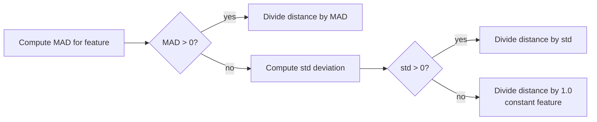
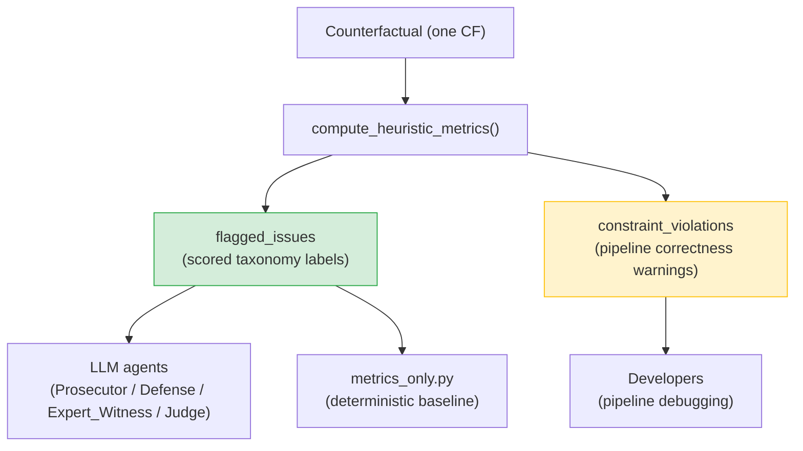
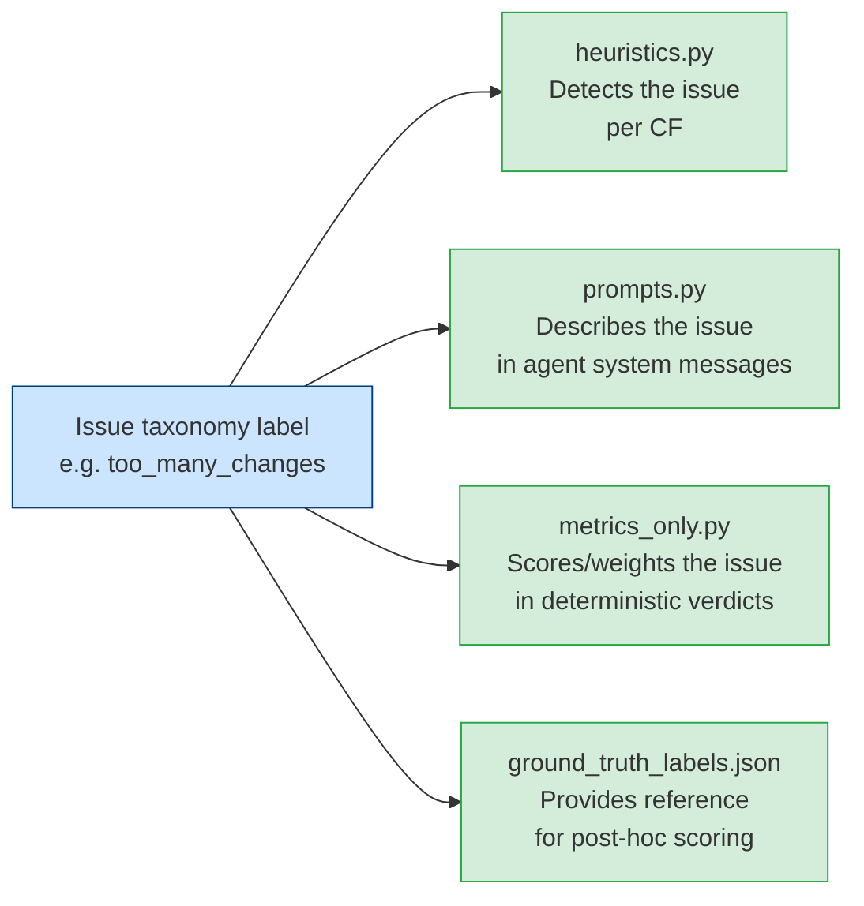

# Session 3 — Deterministic Evaluation Foundations

> *Team walkthrough document. Covers how counterfactuals are measured and judged deterministically — before any LLM is involved. This is the layer the multi-agent debate sits on top of.*

---

## Where this session fits

Sessions 1 and 2 produced artifacts: a trained classifier (`models/logistic_regression.joblib`) and a table of counterfactuals (`results/counterfactuals.csv`). Session 3 is about **measuring and judging** those artifacts deterministically — with no model calls, no stochasticity, no inference costs.

Three modules:

1. `src/pipeline/cf_metrics.py` — the DiCE-paper quantitative metrics (validity, proximity, sparsity, diversity).
2. `src/policy/feature_policy.py` — the parts Session 2 didn't cover: naming dualism, model-vs-raw column split, education sync helpers, and the audit trail.
3. `src/policy/heuristics.py` — the six scored issues, detection logic for each, and the architectural divide between *scored issues* and *constraint violations*.

This session establishes three decisions worth defending in any project review: why MAD normalization, why separate scored issues from constraint violations, and why deterministic rules rather than a learned plausibility classifier.

---

## 1. Quantitative Metrics — `src/pipeline/cf_metrics.py`

The project has 10 individuals and 4 counterfactuals each — 40 CFs in total. The DiCE paper proposes a compact set of quantitative metrics, one per dimension of the validity–proximity–sparsity–diversity trade-off introduced in Session 2.

| Metric | What it answers | Higher / lower better? |
| --- | --- | --- |
| **Validity** | How many requested CFs actually flip the prediction? | Higher (max 1.0) |
| **Continuous proximity** | How far did continuous features have to move? | Closer to 0 (signed negative by convention) |
| **Categorical proximity** | How many categorical features stayed the same? | Higher (max 1.0) |
| **Sparsity** | What fraction of features were left unchanged? | Higher |
| **Continuous diversity** | How different are CFs from each other on continuous features? | Higher |
| **Categorical diversity** | How different are CFs from each other on categorical features? | Higher |
| **Count diversity** | What fraction of features differ between any two CFs, on average? | Higher |

Two points to internalize before going further.

**These metrics do not measure plausibility.** A CF with `capital-gain = $100,000` could score perfectly on validity, sparsity, and diversity while remaining implausible recourse advice. Plausibility is the job of the heuristics (Section 3 below) and the LLM agents (Session 5). The metrics answer *"is this CF mathematically well-formed?"* — nothing more.

**Computed at two levels.** Per-instance: one number per individual, averaged over their four CFs, saved to `cf_metrics_per_instance.csv`. These end up in front of the Expert_Witness agent inside `cases.json`. Global: averaged across all 10 individuals, saved to `cf_metrics_global.csv`, used in the report.

### MAD normalization

This is the module's central idea.

A CF changes a person's `age` by +10 years and their `capital-gain` by +$2,000. Which change is larger? Naïve L1 distance treats the $2,000 change as overwhelmingly more significant — which is wrong. Z-score normalization is an improvement, but standard deviation is inflated by outliers, and several Adult features (especially `capital-gain`) are sharply skewed.

The DiCE-paper fix is **Median Absolute Deviation (MAD)** normalization. For each continuous feature, compute the MAD — the median of absolute deviations from the column's median — and divide every distance by it. The result is in units of *"typical variation of this feature in the population."* A CF that moved `age` by 2 MADs and `capital-gain` by 2 MADs moved both features by an equally drastic amount. MAD is robust to outliers because it is median-based, which is exactly what is needed for skewed financial columns.

#### The fallback hierarchy

MAD has an edge case: if more than 50% of values are at the median, MAD = 0. This is exactly the situation with `capital-gain` — the median is $0 and roughly 92% of individuals have $0. Dividing by zero would produce infinity.



For `capital-gain`, the pipeline falls through to std normalization. This means `capital-gain` proximity values are in **std units**, not MAD units, while `age` proximity values are in MAD units. They appear in the same column of `cf_metrics_per_instance.csv` but are not directly comparable. The Expert_Witness agent does not currently distinguish them — a detail worth flagging in any fine-grained metric interpretation.

### Sign conventions

`continuous_proximity = −(MAD-normalized L1 distance)`. The negation is DiCE-paper convention. Proximity is a desirability metric, so higher should be better; the raw distance is lower-is-better, so the sign is flipped. A continuous proximity of `−0.42` means "the average MAD-normalized distance was 0.42 units" — closer to zero is better.

The same logic applied to other metrics:

- `categorical_proximity = 1 − (fraction of changed categorical features)` — higher = better.
- `sparsity = 1 − (changed features / total features)` — higher = sparser.

This convention matters in practice: the Expert_Witness agent is told these sign conventions explicitly. A flipped sign would cause the LLM to interpret the metric backwards.

### Three diversity metrics

Validity, proximity, and sparsity compare each CF to the original. Diversity is different — it compares CFs to each other.

| Metric | Compares CFs on |
| --- | --- |
| **Continuous diversity** | MAD-normalized distance over continuous features |
| **Categorical diversity** | Fraction of differing categorical features |
| **Count diversity** | Fraction of all features that differ (row-level simplest measure) |

All three are pair-averaged. With `TOTAL_CFS = 4`, that is six pairs per instance.

Three metrics rather than one because they tell different stories. Two CFs that differ only on `workclass` would have high categorical diversity but low continuous diversity. Two CFs that move `age` by wildly different amounts would have the reverse. The Expert_Witness can then say "the CF set is diverse on categorical choices but agrees on the numerical recourse path" — a richer characterization than a single score.

### Validity — a subtle definitional choice

`validity = (# unique valid CFs) / (# requested CFs)`.

Three design choices embedded here. First, normalization is by `TOTAL_CFS` (4), not by the number returned — if DiCE returns only 3 CFs, validity caps at 0.75 even if all 3 are perfect, which penalizes the algorithm for failing to find enough CFs. Second, duplicates are removed before counting, preventing inflated validity by repeating the same answer. Third, "valid" means the predicted class label flips, not the confidence — a CF at 0.51 still counts as valid; *fragility* is a separate concern handled in the heuristics.

### Design alternatives considered

| Alternative | Reason not used |
| --- | --- |
| Raw L1 distance (no normalization) | Units distort comparisons; `capital-gain` dominates everything |
| Z-score normalization | Less robust to outliers; std is inflated by skewed features |
| Mahalanobis distance | More principled but agents would struggle to reason about covariance |
| Plausibility metrics (LOF, isolation forests) | Out of scope here; plausibility lives in the heuristics |

### Downstream implications

Per-instance metrics are read by [src/pipeline/case_builder.py](../../src/pipeline/case_builder.py), which embeds them in each case's `metrics` block. The metric names (`validity`, `continuous_proximity`, etc.) are surfaced verbatim in the Expert_Witness agent's system message — renaming a column would silently break the agent's ability to reason about it. The metrics-only baseline (Session 4) derives metric warnings (`validity_below_one`, `low_sparsity`, `low_*_proximity`) from these values; the thresholds chosen there directly determine what the deterministic baseline flags as severity-elevating.

---

## 2. The Rest of `src/policy/feature_policy.py`

The actionable/frozen split, policy constants, and `permitted_range` builder were covered in Session 2. What remains is **naming infrastructure and helper utilities** — shorter than the other modules in scope, but the file encodes one architectural commitment that holds the whole codebase together: this is the **single source of truth** for the recourse policy. Every other module reads from it.

### The naming dualism

The Adult dataset uses dashed column names: `education-num`, `marital-status`, `hours-per-week`, `capital-gain`, `capital-loss`, `native-country`. Those are fine in a CSV header but unworkable inside Python — `row.education-num` parses as subtraction.

The module maintains a translation table:

```
"education-num"   ↔  "education_num"
"marital-status"  ↔  "marital_status"
"hours-per-week"  ↔  "hours_per_week"
"capital-gain"    ↔  "capital_gain"
"capital-loss"    ↔  "capital_loss"
"native-country"  ↔  "native_country"
```

Dashed names live in raw CSV files and in DiCE's API. Underscored names live in the heuristics, taxonomy labels, agent prompts, and ground-truth annotations.

This is why the module maintains dual lists: `ACTIONABLE_FEATURES` (dashed, for DiCE) and `ACTIONABLE_FEATURES_CANONICAL` (underscored, for heuristics and taxonomy), with the same pair for frozen features. A helper function (`canonical_name`) translates in both directions. The heuristics module normalizes every input row through this function before processing.

The centralization is the point: if any feature is ever renamed, one mapping table changes and the rest of the codebase adapts.

### `RAW_FEATURE_COLUMNS` vs `MODEL_FEATURE_COLUMNS`

The Adult dataset has 14 columns. The model sees only **13** — `education` is excluded because it duplicates `education-num`.

| Tuple | Contents | Used by |
| --- | --- | --- |
| `RAW_FEATURE_COLUMNS` | All 14 columns | `case_builder.py` (surfaces full feature dicts to agents) |
| `MODEL_FEATURE_COLUMNS` | 13 columns (excludes `education`) | `train.py`, `predict.py`, `generate_cf.py` |

The split is enforced through `select_model_features(X)`, a thin wrapper that drops the excluded columns from any input frame. Every place that hands data to the model goes through this function — changing the exclusion list means editing one tuple.

### The education sync machinery

`education-num` is an integer (1–16); `education` is a string label ("HS-grad", "Bachelors", …). They are redundant — the integer fully determines the label via `EDUCATION_NUM_TO_LABEL`. Because `education` is excluded from the model, DiCE never changes it directly. After generation, the code re-syncs the label so the output CSV stays human-readable.

Three helpers do this work. `education_label_from_num(n)` maps integer to string. `sync_education_label(row)` / `sync_education_labels(df)` rewrite the label to match the current integer; called automatically after DiCE generation. The third, `is_synchronized_education_label_change(original, cf)`, is the interesting one: it returns `True` if the only reason `education` looks "changed" is that it was re-synced from a legitimately changed `education-num`.

Without that third helper, every legitimate `education-num` change would also register as a spurious `education` change, and the heuristic for `education_changed_without_education_num_sync` would fire on every clean CF. The helper bridges sync logic and heuristics — it screens out the expected case so the heuristic only fires on the real pipeline bug (label changed but number didn't, or number changed without label update).

### `generation_policy_metadata()` — the audit trail

`generation_policy_metadata()` returns a dictionary describing the entire recourse policy: actionable features, frozen features, DiCE genetic weights, the education mapping, causal checks (age must increase, education-num must increase, etc.). This dictionary is written to `results/generation_policy.json` every time `generate_cf.py` runs.

When policy parameters are swept (say, `AGE_MAX_INCREASE` from 8 to 3) and CFs are regenerated, two different `cases.json` files exist in two different run folders. The policy JSON records which set of parameters produced which set of CFs. Without it, comparing runs requires guesswork. The policy JSON is also read by `case_builder.py` and embedded in each case's `generation_policy` block — so it is not just an audit artifact but part of the LLM evaluation context.

### What this module commits to architecturally

This module's job is to **own the vocabulary** of the recourse policy. The commitment: any policy decision — what's actionable, what's frozen, the maximum age delta, how education labels map to numbers — lives here and nowhere else. When any part of the codebase asks "where is X decided?", the answer is either `feature_policy.py` (static policy) or `heuristics.py` (derived per-CF facts). There is no third place.

**Downstream notes:** the naming dualism is unforgiving — adding a new feature requires updating `FEATURE_ALIASES`, the relevant `_CANONICAL` lists, and any sync-style helpers; forgetting one will silently mismatch agents and heuristics. `select_model_features()` is the gate to the model; everything touching the classifier goes through it.

---

## 3. The Six Scored Issues — `src/policy/heuristics.py`

This is the densest module in the project. It is also the one that defines the evaluation layer's conceptual vocabulary — the set of quality judgments that every downstream system (metrics-only baseline, LLM agents, visualizations) inherits.

### What the module produces

For every counterfactual, `compute_heuristic_metrics()` returns a dictionary:

```python
{
    "changed_features": ["age", "education_num", "hours_per_week"],
    "changes":          {"age": {"old": 25, "new": 28}, ...},
    "sparsity":         3,         # raw count of changed features
    "actionable_sparsity": 3,      # count restricted to actionable features
    "burden_count":     2,         # actionable count after coupling adjustments
    "flagged_issues":   ["fragile_counterfactual", "unactionable_capital_shift"],
    "constraint_violations": [],
    "issue_evidence":   {"fragile_counterfactual": [{...}], ...},
    "constraint_evidence": {},
}
```

`case_builder.py` calls this once per CF and stitches the results into each case. Every downstream consumer reads this output and treats it as the deterministic ground truth about what is — or is not — wrong with each CF.

### The two-channel split

The module maintains two strictly separated output lists for every CF:



The design principle is precise:

**`flagged_issues` answers: "is this CF a good recourse explanation?"**
**`constraint_violations` answers: "did the pipeline behave correctly?"**

The same numerical anomaly can fire both channels simultaneously. If DiCE returns `age = 22` for a 25-year-old, the heuristic adds `implausible_time_dependent_change` to `flagged_issues` (the CF is unrealistic as recourse) and `age_outside_permitted_range` to `constraint_violations` (the pipeline produced something it shouldn't have). The split exists so that pipeline bugs are surfaced separately from quality judgments, and so that fixing a pipeline bug requires no change to the evaluation taxonomy. Agents are explicitly told to never include constraint violations in their scored verdicts.

### The six scored issues

Each scored issue corresponds to one label in `ISSUE_TAXONOMY` in `src/agents/prompts.py` — the same labels used in `annotations/ground_truth_labels.json` and in the LLM agent prompts.

#### 1. `fragile_counterfactual`

**Trigger:** `0.5 ≤ cf_confidence < FRAGILITY_THRESHOLD (0.60)`.

DiCE's `stopping_threshold = 0.5` means it accepts a CF the moment `predict_proba(class=1)` crosses 0.5. This produces CFs that barely flip — confidence 0.51, 0.53, 0.58. They are valid in the strict sense but brittle: a few percent of noise in any feature would flip them back. The 0.60 threshold defines "comfortable distance from the decision boundary"; below it, the CF is valid but not trustworthy as recourse advice.

This issue is not in the `CRITICAL_ISSUES` set used by the metrics-only baseline (Session 4). A fragile CF is still a valid CF; it nudges severity up subtly rather than escalating it hard.

#### 2. `implausible_time_dependent_change`

The multi-faceted issue. Triggers when **any** of the following holds:

- `age` decreased.
- `age` is not integer-valued.
- `age` increased by more than `AGE_MAX_INCREASE` (8 years).
- `education_num` decreased.
- `education_num` is not integer-valued.
- `education_num` increased by more than `EDUCATION_NUM_MAX_INCREASE` (4 levels).
- `education_num` increased *without* `age` increasing (no time elapsed to support the new education).
- `education_num` increased *more than* `age` increased (more education levels gained than years passed).

The coupling sub-check is the most important case. If `education_num` went up by 4 and `age` went up by 1, both deltas are individually within their permitted ranges — yet the CF is still implausible. Per-feature box constraints cannot catch this. That is the reason this heuristic exists.

#### 3. `extreme_working_hours`

**Triggers** when the new `hours_per_week` value falls into any of:

- Increased by ≥ `HOURS_MAX_INCREASE` (15 hours).
- Decreased by ≥ `HOURS_MAX_DECREASE` (10 hours).
- Below 20 hours absolute.
- At or above 60 hours absolute.

A CF saying "work 75 hours a week and the model would predict >50K" is valid but the recourse is unreasonable — recommending burnout is not actionable advice. Similarly, "work 15 hours" is not actionable for someone trying to earn more. The thresholds bound both the absolute regime and the change magnitude; either alone can trigger.

#### 4. `unactionable_capital_shift`

**Trigger:** `capital_gain` or `capital_loss` delta ≥ `CAPITAL_LARGE_JUMP_THRESHOLD` (3000), or value went from $0 to ≥ $3000.

This is the delta-plausibility check that the box constraint cannot perform. The per-instance permitted range might allow `capital-gain ∈ [0, $10,000]` — a CF at $4,500 passes that range check. But a $0 → $4,500 capital-gain shift in a realistic recourse horizon for someone currently classified ≤50K is not actionable. The model strongly exploits `capital-gain` as a shortcut, and DiCE follows. This issue gives the agents the vocabulary to push back on those CFs.

#### 5. `inconsistent_work_profile`

**Trigger:** `workclass` is "Without-pay" or "Never-worked" but `occupation` is set (not null) — or the reverse.

A CF proposing "switch to Without-pay workclass but keep your Tech-support occupation" is internally contradictory. The heuristic is deliberately narrow: it only flags the cleanest case of direct contradiction. It does not attempt to infer general workclass/occupation incompatibilities; agents are explicitly told not to invent these either.

The taxonomy entry states: *"Flag only when deterministic heuristic evidence explicitly reports a direct workclass/occupation contradiction. Do not infer this label from ordinary workclass or occupation changes."* The discipline: when in doubt, do not flag.

#### 6. `too_many_changes` — the burden count

**Trigger:** `burden_count ≥ 3`, where `burden_count` is the count of changed actionable features, with two coupling adjustments:

- `(workclass, occupation)` changed together → counts as **1** logical intervention.
- `(age, education_num)` changed together → counts as **1** logical intervention.

A CF that changes 5 features asks a lot of the recipient. Recourse is an actionable plan, not a life overhaul.

The coupling adjustments reflect how humans actually think about decisions. Changing `workclass` and `occupation` together is one career switch, not two separate feature changes. Changing `age` and `education_num` together is one life-stage plan.

Two worked examples:

- CF changes `(age, education_num, hours-per-week, capital-gain)` → 4 raw features, `burden_count = 3` (age/education pair counts once). Still above threshold, still flagged.
- CF changes `(workclass, occupation, hours-per-week)` → 3 raw features, `burden_count = 2` (workclass/occupation pair counts once). Not flagged.

### Constraint violations — the developer-facing channel

| Label | Meaning |
| --- | --- |
| `{feature}_changed_despite_being_frozen` | A frozen feature (race, sex, native-country, marital-status, relationship, fnlwgt) was mutated — DiCE constraint failure. |
| `education_changed_without_education_num_sync` | Display label changed but integer didn't (or doesn't match). Sync helper failed. |
| `{feature}_outside_permitted_range` | Value escaped its per-instance box constraint — DiCE bug or numerical artifact. |
| `{feature}_invalid_value` | Value could not be parsed as a number where one was expected. Upstream data corruption. |
| `cf_confidence_invalid_value` | `cf_confidence` could not be parsed as a number. Pipeline issue. |

None of these belong in a quality verdict. They are the pipeline misbehaving, not the CF being unrealistic. The metrics-only baseline treats their presence as automatic severity escalation to `high` and assessment `unfair` — but they are tracked in a separate field, never in `flagged_issues`.

### The evidence dictionaries

Every flagged issue is accompanied by a structured evidence entry: a dictionary with the delta, the threshold, the affected feature, and a one-sentence `reason`. An `unactionable_capital_shift` entry looks like:

```python
{
    "feature": "capital_gain",
    "old": 0.0,
    "new": 4500.0,
    "delta": 4500.0,
    "large_jump_threshold": 3000,
    "reason": "The counterfactual relies on a large financial shift that may not be realistically actionable."
}
```

Three reasons this matters. First, agents quote evidence instead of inventing numbers — Prosecutor, Defense, and Expert_Witness are told to use `issue_evidence` rather than recompute or guess values. When the Prosecutor says "the capital-gain delta of $4,500 exceeds the $3,000 threshold," that is the LLM reading from the evidence dict, not doing arithmetic. Second, multiple deltas can carry the same label — a CF that violates both "age non-integer" and "education > age" produces two evidence entries under `implausible_time_dependent_change`. Third, the evaluation chain becomes fully traceable: verdict → case → CF → evidence dict → the specific delta that drove the flag. No black-box reasoning.

### Why determinism — not a learned classifier

A reasonable question: why hand-code these six rules instead of training a "is this CF plausible?" classifier from human-labeled examples?

Three reasons. **Reproducibility:** deterministic rules produce the same output on the same input, forever. A learned classifier drifts with retraining. The deterministic layer must be fixed for the project's central comparison to work. **Interpretability:** when the Judge sees `flagged_issues = ["too_many_changes"]`, any team member can look at the code and see exactly why. **Anti-circularity:** training a plausibility classifier would require the labeled examples in `annotations/ground_truth_labels.json` — but the project's research question is "do LLMs add value over deterministic rules?" If the deterministic layer were a learned classifier, the project would be comparing one ML system to another ML system, and the experimental design would collapse.

The trade-off is explicit: the rules are simple and miss subtleties. The agents and human annotations are supposed to catch what the heuristics miss. That is the design rationale for the multi-agent debate layer.

### The four-way taxonomy sync



Adding a new issue label requires touching all four. Adding a label that is not detected in `heuristics.py` means agents could use it but heuristics could never trigger it — the metrics-only baseline would never produce it, breaking the three-way comparison.

This module is consumed in four places:

1. **`case_builder.py`** calls `compute_heuristic_metrics()` once per CF and embeds the result in `counterfactuals[*].heuristic_metrics`. It also computes a case-level union in `heuristic_summary` (the OR of all issues across all CFs for that individual).
2. **`metrics_only.py`** reads `heuristic_summary.flagged_issues_union` and `constraint_violations_union` directly. The deterministic verdict is essentially a transformation of this output.
3. **LLM agents** receive the heuristic output inside their prompt JSON and are explicitly instructed to treat it as the source of truth for scored issues.
4. **Ground-truth annotations** in `annotations/ground_truth_labels.json` use the same six labels.

### Heuristics design alternatives

| Alternative | Reason not used |
| --- | --- |
| Learned plausibility classifier | Reproducibility, interpretability, and anti-circularity (see above) |
| Combine `flagged_issues` and `constraint_violations` into one list | Mixes "your CF is bad" with "your pipeline is buggy" — different audiences, different actions |
| Emit labels only, no evidence dictionaries | Agents would have to recompute or hallucinate evidence; the dicts are the antidote |
| Hard-code coupling rules in taxonomy text | Agents would have to interpret the rule; `burden_count` resolves coupling once, deterministically |

---

## Key takeaways

**The metrics measure mathematical well-formedness, not plausibility.** Validity, proximity, sparsity, and diversity tell us whether a CF is clean by DiCE's own standards. Plausibility lives in the heuristics and agents.

**MAD normalization is what makes proximity meaningful across features with different units and scales.** It is robust to outliers and falls back to std (then 1.0) when MAD = 0. `capital-gain` proximity is computed in std units due to the 92% zero-inflation — a comparability caveat worth noting if fine-grained metric interpretation becomes part of the analysis.

**Sign convention: higher is better for every metric in this module.** Continuous proximity is negated to maintain this convention; a proximity of −0.42 means a MAD-normalized distance of 0.42.

**`feature_policy.py` owns the recourse policy vocabulary.** Two naming conventions (dashed for CSV/DiCE, underscored for everything else), `MODEL_FEATURE_COLUMNS` vs `RAW_FEATURE_COLUMNS`, `select_model_features()` as the model gate, `generation_policy.json` as the audit trail. One file, one source of truth.

**The two-channel split in `heuristics.py` is a deliberate architectural rule:** `flagged_issues` for quality judgments (agents and baseline), `constraint_violations` for pipeline correctness (developers). The same anomaly can fire both. They are never merged.

**There are six scored issues, each with controlling constants in `feature_policy.py`.** The most architecturally interesting are `unactionable_capital_shift` (catches delta plausibility that box constraints cannot) and `too_many_changes` (with burden-count coupling adjustments for career-switch and life-stage pairs).

**Evidence dictionaries are the project's antidote to LLM number-invention.** Agents quote them; they do not recompute. This is what makes the evaluation chain traceable from verdict back to specific feature delta.

**Determinism is a research design choice, not a limitation.** The deterministic layer must be fixed and auditable for the project's central comparison (metrics-only vs single-LLM vs multi-agent) to be valid. The heuristics are simple by design; the agents and human annotations are layered on top to capture what the rules miss.

**The four-way taxonomy sync is non-negotiable.** Any new issue label must be added to `heuristics.py`, `prompts.py`, `metrics_only.py`, and `annotations/ground_truth_labels.json` together.

---

## Files referenced in this session

- [src/pipeline/cf_metrics.py](../../src/pipeline/cf_metrics.py)
- [src/policy/feature_policy.py](../../src/policy/feature_policy.py)
- [src/policy/heuristics.py](../../src/policy/heuristics.py)
- [src/agents/prompts.py](../../src/agents/prompts.py) — `ISSUE_TAXONOMY` and guidance formatters (deep dive in Session 5)
- [src/evaluators/metrics_only.py](../../src/evaluators/metrics_only.py) — downstream consumer (deep dive in Session 4)
- [src/pipeline/case_builder.py](../../src/pipeline/case_builder.py) — the orchestrator that calls `compute_heuristic_metrics()` per CF (deep dive in Session 4)
- [annotations/ground_truth_labels.json](../../annotations/ground_truth_labels.json) — the human reference labels using the same taxonomy
