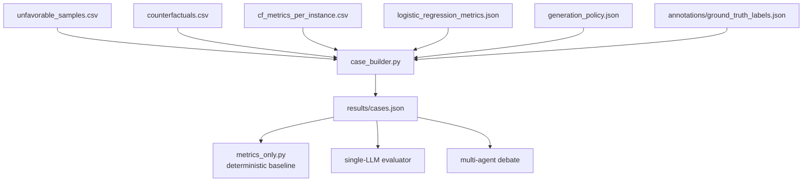
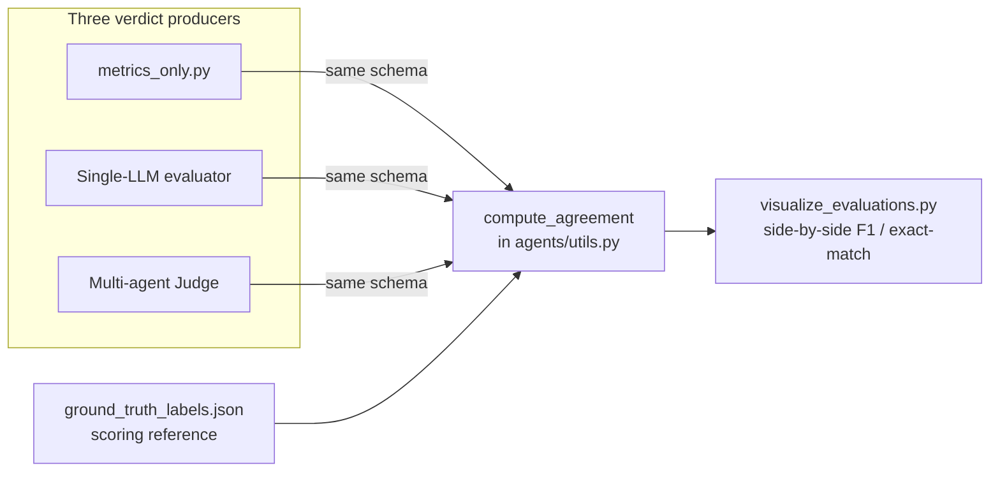
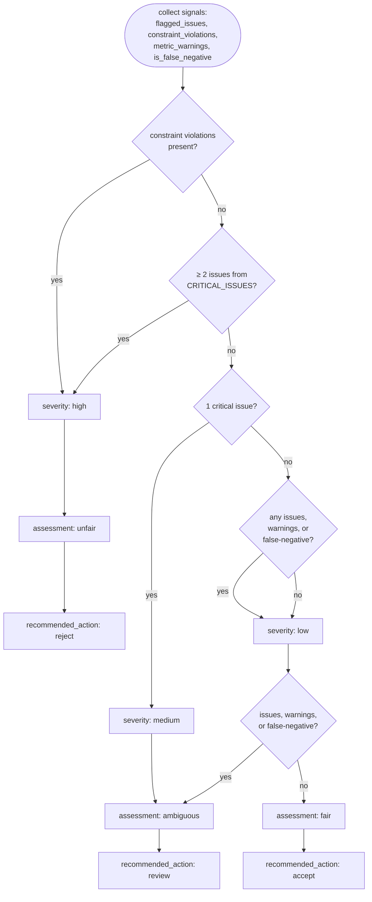

# Session 4 — Bridge & Deterministic Baseline

> *Team walkthrough document. Covers how raw ML artifacts are stitched into the single JSON object that drives all three evaluation systems, and how the deterministic baseline produces verdicts in the same schema as the LLM Judge so comparison across systems is honest.*

---

## Where this session fits

Sessions 1–3 produced **artifacts**: a trained classifier, a CSV of counterfactuals, per-instance DiCE metrics, and per-CF heuristic evidence. Session 4 is where all of that gets:

1. **Stitched together** into a single canonical JSON object (`cases.json`) that all three evaluation systems consume.
2. **Evaluated deterministically**, producing the project's non-LLM baseline.

Three modules:

- `src/pipeline/case_builder.py` — the bridge layer that produces `cases.json`.
- `src/evaluators/metrics_only.py` (+ the thin `scripts/run_metrics_only.py` orchestrator) — the deterministic baseline.
- `annotations/ground_truth_labels.json` — the project's reference labels.

This session establishes three design decisions worth defending in any review: why `cases.json` exists as a separate artifact rather than passing CSVs around, why the metrics-only baseline produces verdicts in the same schema as the Judge, and why the research arc is framed as it is — *"do LLMs add value over a deterministic baseline that already encodes most of the taxonomy?"*

---

## 1. The Bridge Layer — `src/pipeline/case_builder.py`

By this point the pipeline has produced six artifacts of different shapes and conventions:

| Artifact | Produced by | What it contains |
|---|---|---|
| `results/unfavorable_samples.csv` | `predict.py` | 10 sampled individuals + prediction/proba/true_label |
| `results/counterfactuals.csv` | `generate_cf.py` | Originals + 4 CFs each, with `cf_confidence`, `row_type`, `cf_rank` |
| `results/cf_metrics_per_instance.csv` | `cf_metrics.py` | Validity, proximity, sparsity, diversity per individual |
| `results/logistic_regression_metrics.json` | `train.py` | Model-level accuracy / precision / recall / F1 |
| `results/generation_policy.json` | `generate_cf.py` | Audit trail: which policy was active |
| `annotations/ground_truth_labels.json` | (project team) | Reference labels per case |

All six could be handed directly to the evaluation layer and let each evaluator read what it needs. That approach is worse than it sounds: it couples every evaluator to every artifact's CSV/JSON shape, encoding conventions, and join semantics. Any rename or restructure ripples through three downstream systems (metrics-only, single-LLM, multi-agent) — guaranteed drift over time.

`case_builder.py` is the **one place that knows how to read the ML side and produce the LLM-side format**. It performs all the joins, computes the per-CF heuristic metrics, builds the per-CF `changes_summary`, injects the reference labels, and writes a single `results/cases.json` that downstream evaluators consume verbatim. Everything north of it is pandas DataFrames; everything south is JSON objects.



### Case schema

A case is the unit all evaluators reason about — one individual and their counterfactual set. Top-level fields:

```
case_id, domain
original                 (the 14 raw features)
prediction, prediction_confidence, true_label, is_false_negative
model_info               (accuracy, precision, recall, F1 of the classifier)
generation_policy        (snapshot of the active policy when CFs were generated)
metrics                  (case-level DiCE metrics — validity, proximities, etc.)
heuristic_summary        (case-level union of flagged_issues + constraint_violations)
counterfactuals[]        (array of 4 CF dicts)
ground_truth_issues      (case-level reference labels — for scoring only)
ground_truth_by_cf       (per-CF reference labels)
ground_truth_source      (provenance metadata)
```

Each entry in `counterfactuals[]`:

```
cf_rank                  (0..3, sorted by DiCE's preference)
cf_confidence            (predict_proba for class 1)
features                 (full 14 feature values of this CF)
features_changed         (list of feature names that differ from the original)
changes_summary          ({feature: {"from": ..., "to": ...}})
heuristic_metrics        (full output of compute_heuristic_metrics for this CF)
```

### Two-layer aggregation: per-CF vs case-level

Heuristic information is computed at the **per-CF level** (`heuristic_metrics`) and aggregated to the **case level** (`heuristic_summary`). The difference matters:

- `counterfactuals[i].heuristic_metrics` — the full output of `compute_heuristic_metrics()` for *that* CF: its flagged issues, evidence, burden count, constraint violations.
- `heuristic_summary.flagged_issues_union` — the OR across all 4 CFs: *"did any CF in this set have this issue?"*
- `heuristic_summary.constraint_violations_union` — the same OR for constraint violations.

The case-level union is what the Judge starts from when forming a verdict. The per-CF metrics are what specialists drill into when arguing about a specific CF. Downstream agents are explicitly told to use both, so the distinction has to hold in the data.

### `_safe_python()` — small function, load-bearing

Values flowing through the ML pipeline arrive in `case_builder.py` as a mix of `np.int64`, `np.float64`, `np.bool_`, and the occasional `float('nan')`. None of these survive `json.dump` cleanly:

- `np.int64(35)` raises a `TypeError`.
- `float('nan')` *does* serialize, but as the literal string `NaN` — which is not valid JSON and chokes every parser downstream.

`_safe_python()` is the single coercion function applied to every value before it enters the case dict: `np.integer → int`, `np.floating → rounded float`, `np.bool_ → bool`, `NaN → None` (which serializes as `null`). Forgetting it is the project's most common silent failure mode. The case file looks fine on disk, but agents receive `"validity": NaN` in their prompt, the model returns a malformed verdict, and an hour gets spent debugging the LLM before the real cause becomes visible.

### Ground-truth labels: injected here, stripped before the LLM sees them

Labels from `annotations/ground_truth_labels.json` are **injected** into each case by `case_builder.py` — as `ground_truth_issues`, `ground_truth_by_cf`, and `ground_truth_source`. They are then **stripped** before any case reaches an LLM. The stripping happens in `_compact_case_for_prompt()` in `src/agents/debate.py`, which builds the JSON the agents actually see; the `ground_truth_*` fields are deliberately omitted.

If labels leaked into the prompt, the experiment would measure whether the LLM can copy them back. The labels are for **scoring** the verdict after the LLM has produced it, not for guiding the LLM during reasoning. The metrics-only baseline does not use them either — they are only read at scoring time by `compute_agreement()` in `src/agents/utils.py`.

### The compact prompt subset

The full case JSON contains the complete feature dict of every CF — 14 features × 4 CFs per case, plus full evidence dictionaries with explanatory `reason` fields. That is several thousand tokens of redundant detail.

`_compact_case_for_prompt()` produces a slimmer version: per-CF feature dicts are dropped (the `changes_summary` already says what changed; a CF is the original modified by those changes — the rest is inferable), evidence `reason` strings are dropped (agents have taxonomy descriptions in their system message), and ground-truth labels are stripped. Heuristic metrics, case-level metrics, `model_info`, `generation_policy`, and `heuristic_summary` are all kept.

The compaction is what makes multi-agent debate fit inside Groq's 6,000-tokens-per-minute free-tier budget. Without it, a single case would exceed TPM on the first specialist turn.

### Design choices

| Choice | Why |
|---|---|
| One JSON file with all 10 cases | Simpler artifact, easier to diff, easier to load. |
| Per-CF `heuristic_metrics` + case-level `heuristic_summary` (both) | Different audiences. Specialists drill into per-CF; Judge starts from union. |
| Snapshot `generation_policy` into each case | Audit trail — old `cases.json` files remain self-documenting. |
| Snapshot `model_info` into each case | Same. *"Which model accuracy was this evaluated against?"* answerable from the case alone. |
| Strip ground-truth labels before LLM | Avoids label leakage. Labels are scoring-only. |
| Compact the case for prompts | Token budget — without it, multi-agent debate doesn't fit in the free tier. |

### Downstream implications

**The case schema is a contract.** Renaming a field here breaks every evaluator and the visualization layer. This is the single highest-leverage file in the project for accidental breakage.

The Expert_Witness agent's system message references `metrics.validity`, `metrics.continuous_proximity`, and other fields by exact name. Renaming any of those silently breaks the agent's reasoning without surfacing an error.

The metrics-only baseline reads `heuristic_summary` directly. Its severity decisions depend on the case-level union, not on per-CF flags. Changing how the union is computed shifts baseline verdicts without any explicit code change to the evaluator.

Three alternatives that were considered and rejected: sending raw CSVs to agents (forces each evaluator to re-implement the joins, high drift risk); a database-backed case store (overkill for 10 cases); maintaining two separate `cases.json` files — one with labels for scoring, one without for prompts (sync problems, cleaner to keep one file and strip at prompt-build time).

---

## 2. The Deterministic Baseline — `src/evaluators/metrics_only.py`

This module reads `cases.json`, applies a deterministic mapping, and produces verdicts in *exactly the same JSON schema as the LLM Judge*. Two things to internalize before reading the code:

**It is a competitor, not ground truth.** It plays the same role as the single-LLM and the multi-agent system: a candidate evaluator scored against the reference labels. It just happens to be the only deterministic one.

**It is intentionally strong.** Most of the project's taxonomy is already encoded in the heuristics layer; the baseline reads that output and converts it to a verdict almost mechanically. Comparing LLM systems against it is not comparing against "naïve rules" — it is comparing against a deterministic system that already knows the taxonomy. Beating it requires the LLMs to contribute something rules cannot. If the baseline were weak, a positive result would be trivial and uninteresting. Making it strong is what makes the comparison meaningful.

The research arc follows directly:

> *Do LLM-based evaluation systems — and specifically a multi-agent adversarial debate — produce better verdicts than a deterministic rules-based baseline that already encodes most of the evaluation criteria?*

### Shared verdict schema

The Judge produces verdicts shaped like:

```json
{
    "case_id": 0,
    "overall_assessment": "fair | unfair | ambiguous",
    "flagged_issues": ["issue_label_1"],
    "severity": "low | medium | high",
    "confidence": 0.85,
    "reasoning_summary": "...",
    "recommended_action": "accept | review | reject"
}
```

The metrics-only baseline produces verdicts with **the same fields**. The visualization layer (`scripts/visualize_evaluations.py`) computes side-by-side precision, recall, F1, and exact-match rates against the reference labels across all three evaluators. If the schemas differed, every comparison would need an ad-hoc adapter — and the comparison itself would be less honest, because there would be no shared definition of "verdict" across systems. The Judge's reasoning may be richer; the baseline's severity may be coarser. But the output contract is identical.



### Decision logic

The baseline collects three kinds of signal from each case:

1. **`flagged_issues`** — scored issue labels from `heuristic_summary.flagged_issues_union`, filtered to the valid taxonomy.
2. **`constraint_violations`** — pipeline-correctness violations (frozen-feature edits, out-of-range values).
3. **`metric_warnings`** — non-taxonomy warnings derived from DiCE metric thresholds: `validity_below_one`, `low_sparsity`, `low_continuous_proximity`, `low_categorical_proximity`. These are not scored labels (they do not appear in `flagged_issues`), but they elevate severity and shape the rationale.

It also reads `is_false_negative` as a context modifier. From these signals, verdict fields are derived through a short cascade of rules:



Confidence values are static per regime: 0.95 when constraint violations are present, 0.85 when issues are present but no violations, 0.75 otherwise. The baseline has no probabilistic reasoning; the constants are chosen so that confidence comparisons against LLM outputs are not structurally distorted by one system always anchoring at 0.95 and the other varying freely.

### `CRITICAL_ISSUES` — what escalates severity

Five of the six scored issue labels are critical:

- `too_many_changes`
- `unactionable_capital_shift`
- `implausible_time_dependent_change`
- `extreme_working_hours`
- `inconsistent_work_profile`

Notably absent: **`fragile_counterfactual`**.

A fragile CF is still valid — it crosses the decision boundary, just barely. It is a CF that would not be recommended, not a CF that is broken. Marking it critical would inflate the baseline's "unfair" rate on cases where DiCE produced perfectly reasonable CFs that happen to land near the threshold. Keeping `fragile_counterfactual` non-critical lets it nudge severity upward subtly without dominating the verdict. This is a calibration decision: if the project later determined fragile CFs were unacceptable, adding the label to `CRITICAL_ISSUES` and re-running would show the effect immediately in the visualization layer.

### Metric warnings — separate from scored issues

The metric warnings come from explicit thresholds on the DiCE metrics block:

```
validity_min               = 1.0
sparsity_low               = 0.65
continuous_proximity_low   = -1.0
categorical_proximity_low  = 0.70
```

These are not part of the issue taxonomy. They appear in a separate `metric_warnings` field in the verdict, never in `flagged_issues`. The agents are not told these threshold values — they reason from raw metric values directly. So the baseline can flag "low sparsity" mechanically; an LLM has to infer it. Whether LLMs pick up on borderline metrics is one of the things the project measures.

### Constraint violations as their own field

When constraint violations are present, the baseline includes a separate `constraint_violations` field in the verdict in addition to forcing severity to `high` and assessment to `unfair`. The Judge does not typically produce this field — agents are instructed not to include constraint violations in scored output — so this is one of the few asymmetries between the baseline and LLM schemas. The asymmetry is harmless: `compute_agreement()` only compares `flagged_issues`, not auxiliary fields. Constraint violations surface for debugging visibility, not for scoring.

### `scripts/run_metrics_only.py`

Thin orchestrator: load `cases.json`, run `evaluate_case_metrics_only()` on each case, collect verdicts, write timestamped and `*_latest.json` files under `results/metrics_only_outputs/`, compute agreement statistics against the reference labels. Supports `--case-ids 0 3 5` to run on a subset.

### Why baseline strength matters scientifically

Three points for the report and any supervisor review:

**It bounds the value of LLM reasoning.** If the LLMs do not outperform this baseline, they are not adding evaluation value — they are adding cost and latency. The project's experimental design depends on this comparison being honest.

**It surfaces taxonomy coverage gaps.** If the baseline matches reference labels almost perfectly, the taxonomy is well-aligned with the heuristic logic and there is little room for LLMs to improve. If it misses many references, that is the gap LLMs are supposed to fill through reasoning and context-awareness.

**It is a regression detector.** Changing a heuristic threshold and watching baseline verdicts shift immediately identifies which CFs are affected, before expensive LLM evaluations are re-run.

### Downstream implications

The verdict schema match is load-bearing: change the schema in this file and the Judge and Single_Evaluator must change at the same time, or the visualization breaks. Severity thresholds and `CRITICAL_ISSUES` are calibration knobs — changing them shifts the baseline's verdict distribution and the LLM comparison, so any change should be documented in `docs/methodology/` for reproducibility. The baseline's static confidence values will appear "flat" on any confidence distribution plot — that is a feature, not a defect, but worth noting in plot captions.

---

## 3. `annotations/ground_truth_labels.json` — brief framing

A JSON file containing reference labels for each of the 10 cases: one entry per case, listing the issue labels judged to apply (using the exact snake_case names from `ISSUE_TAXONOMY`). The schema also includes per-CF labels (`ground_truth_by_cf`) — some labels apply only to specific CFs in the set, not to the case as a whole.

### What the annotation status actually means

The file's `annotation_status` field reads:

```json
"annotation_status": "initial_codex_human_perspective_draft_for_team_review"
```

That phrasing was intentional. These are **draft reference labels**, not an external gold standard. Three reasons the distinction matters:

1. **Human-perspective, not external standard.** The labels reflect the project team's judgment. A different team with different priors could plausibly produce different labels for the same cases.
2. **Internally generated.** A true gold standard comes from outside the project. These did not.
3. **Revisable by design.** As the team's understanding of the taxonomy evolves, the labels can be updated. They are a starting point for the evaluation, not immutable truth.

The methodology docs make this framing explicit: the reference is *"a human-perspective draft produced by the project team to score all three evaluation systems against a common standard, acknowledging that the reference is a project artifact rather than an external ground truth."* As the evaluation methodology review (`docs/methodology/evaluation_methodology_review_2026-05-17.md`) notes, there is a real correlation between heuristic coverage and annotation coverage because the same team wrote both — this is expected and acknowledged. Independent re-annotation by each team member is the mitigation.

### Taxonomy must match exactly

Labels here must use the exact same snake_case strings as `ISSUE_TAXONOMY` in `src/agents/prompts.py`. Mismatches do not error — they silently mis-score. If the annotation used `"fragile_cf"` where the taxonomy says `"fragile_counterfactual"`, the scoring layer would always report a verdict mismatch even when the verdict was correct. This is what makes the four-way sync non-negotiable: any new issue label must be added to `prompts.py`, `heuristics.py`, `metrics_only.py`, and this file together.

### Downstream usage

Labels are read by `case_builder.py` and injected as `ground_truth_issues`, `ground_truth_by_cf`, and `ground_truth_source`. They are stripped before any LLM sees them. They are read again at scoring time by `compute_agreement()`, which compares each verdict's `flagged_issues` against the reference set.

---

## Key takeaways

`case_builder.py` is the project's single translation point between the ML world and the LLM world. Every upstream artifact flows into it; `cases.json` flows out. Renaming a field there breaks every downstream consumer — it is the highest-leverage file in the project for accidental breakage.

Heuristic information lives at two levels in every case: per-CF (`heuristic_metrics`) for specialists to argue about individual counterfactuals, and case-level (`heuristic_summary`) for the Judge to synthesize a verdict. They serve different audiences and both are required.

`_safe_python()` is not optional. Forgetting it turns `float('nan')` into the literal string `NaN` in the LLM's prompt, and the failure surfaces as a mysterious verdict parse error rather than a serialization error. It is the most common source of pipeline bugs.

The ground-truth labels are injected at build time and stripped before the LLM ever sees them. Labels are for scoring verdicts, not for prompting agents. If they leaked into the prompt the entire experiment would collapse to "can the LLM copy labels back."

The metrics-only baseline shares the verdict schema with the LLM Judge by design — that shared schema is what makes apples-to-apples comparison across all three evaluation modes legitimate. The baseline is intentionally a strong opponent: it already encodes most of the taxonomy. Beating it requires the LLMs to add something rules cannot.

`fragile_counterfactual` is deliberately excluded from `CRITICAL_ISSUES`. A fragile CF is shaky, not broken. Marking it critical would inflate the baseline's "unfair" rate on perfectly valid CFs that land close to the decision boundary.

Metric warnings (`validity_below_one`, `low_sparsity`, etc.) are tracked in their own field, separate from scored issues. Agents are not told the threshold values and must infer the same judgments from raw numbers. The reference labels are a draft project artifact, not an external gold standard — the framing matters in the methodology section and explains why the deterministic baseline matches them as closely as it does.

---

## Files referenced in this session

- [src/pipeline/case_builder.py](../../src/pipeline/case_builder.py)
- [src/evaluators/metrics_only.py](../../src/evaluators/metrics_only.py)
- [scripts/run_metrics_only.py](../../scripts/run_metrics_only.py)
- [annotations/ground_truth_labels.json](../../annotations/ground_truth_labels.json)
- [src/agents/debate.py](../../src/agents/debate.py) — `_compact_case_for_prompt()` does the LLM-side stripping
- [src/agents/utils.py](../../src/agents/utils.py) — `compute_agreement()` is the scoring function
- [scripts/visualize_evaluations.py](../../scripts/visualize_evaluations.py) — consumes all three systems' verdicts side-by-side
