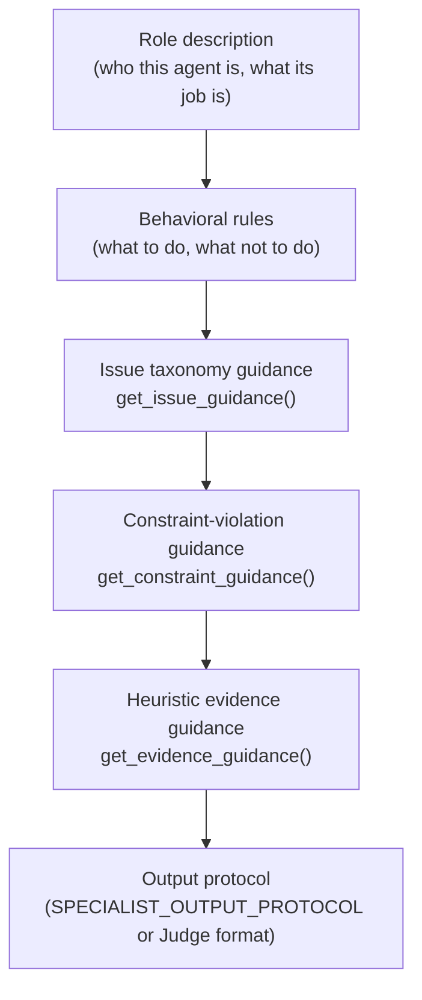
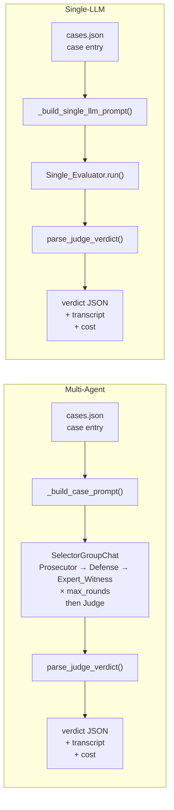
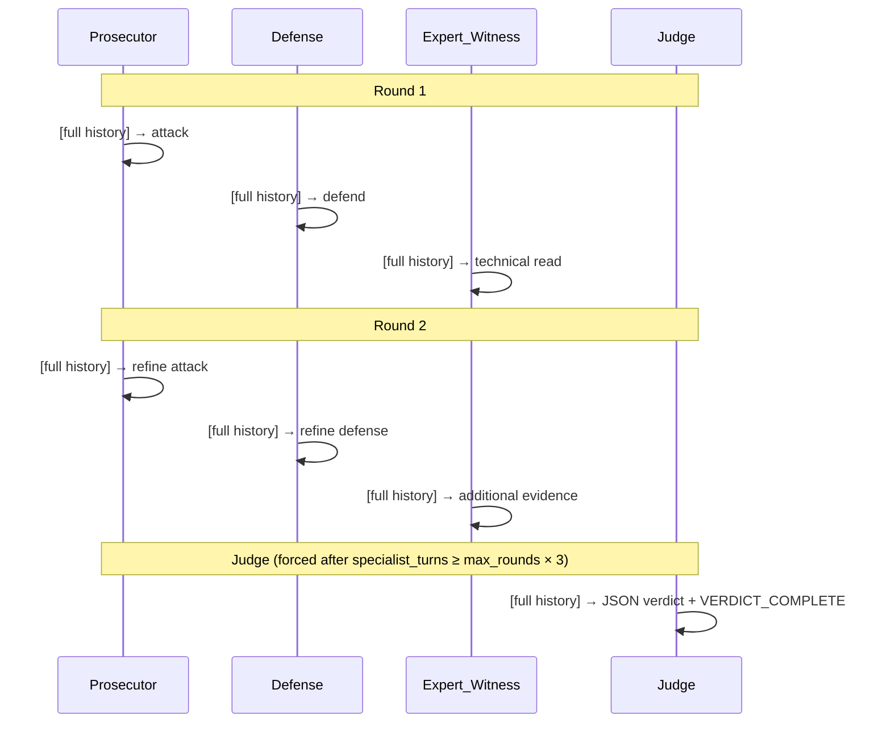
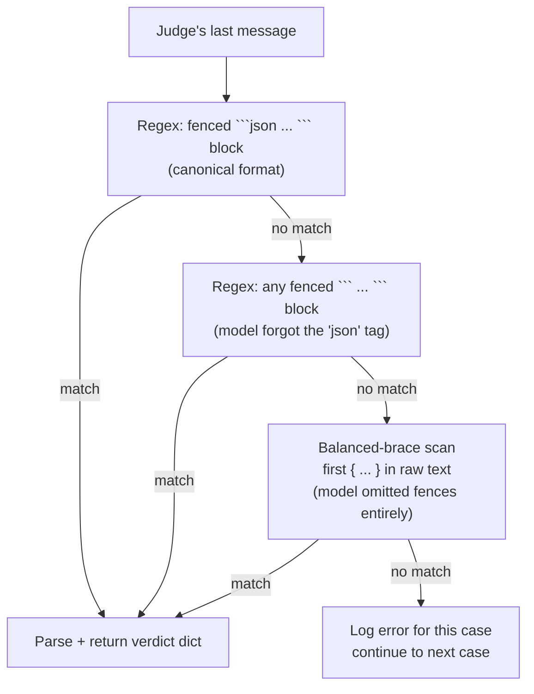

# Session 5 — The LLM Evaluation Layer

> *Walkthrough document for the project team. Covers everything in `src/agents/`: the shared vocabulary that ties the whole evaluation layer together, the Groq-only client config, the four debate roles and one baseline agent, and the orchestration layer that runs them across cases.*

---

## Where this session fits

Sessions 1–4 cover the data, the model, counterfactual generation, the deterministic metrics and heuristics, and the `cases.json` bridge. Session 5 is everything that runs on top of that: how LLMs evaluate the cases, why they're structured the way they are, and what the empirical record says about how well the instructions hold up in practice.

Four modules:

1. `src/agents/prompts.py` — the issue taxonomy and the three guidance formatters injected into every agent.
2. `src/agents/config.py` — Groq-only LLM configuration.
3. `src/agents/agents.py` — the four debate agents and the single-LLM baseline.
4. `src/agents/debate.py` + `scripts/run_debate.py` — `SelectorGroupChat` orchestration, verdict parsing, and run management.

By the end, any team member reading this cold should be able to explain what each agent contributes, trace how a verdict gets parsed, and know why the pacing parameters are set where they are.

---

## 1. The Shared Vocabulary — `src/agents/prompts.py`

The most important framing for this module: the taxonomy is not a list of labels — it is a **contract**. Every consumer in the pipeline agrees to use the same strings with the same meanings. Mismatches don't raise errors; they silently mis-score.

### `ISSUE_TAXONOMY` — the five active scored labels

| Label | Meaning |
|---|---|
| `implausible_time_dependent_change` | age / education_num change violates time logic. |
| `extreme_working_hours` | hours_per_week reaches an unrealistic extreme or large jump. |
| `unactionable_capital_shift` | capital_gain / capital_loss change is financially implausible. |
| `too_many_changes` | burden_count too high; the CF asks too much of the recipient. |
| `fragile_counterfactual` | cf_confidence barely above 0.5; the CF is brittle. |

These are the only labels agents may put into `flagged_issues`. Anything else is invalid.

> **Phase 2 note.** `inconsistent_work_profile` was removed from the active taxonomy after the methodology pivot. The LLM systems are now evaluated for substitution feasibility against the metrics-only reference system. See the [Phase 2 overview](phase_2/phase_2_overview.md).

### `CONSTRAINT_VIOLATION_GUIDANCE` — three pipeline-correctness categories

- `frozen_feature_changed` — a frozen feature was mutated (DiCE constraint failure).
- `invalid_value` — a feature contains an invalid, missing, or unparseable value.
- `outside_permitted_range` — a value escaped its per-instance box constraint.

These are not scored labels. Agents are instructed to mention them in `reasoning_summary` when relevant, but never to place them in `flagged_issues`. The separation mirrors the architectural divide covered in Session 3: heuristic plausibility issues vs. pipeline-correctness violations are distinct things, and collapsing them corrupts the scoring.

### The three guidance formatters

Three functions produce text chunks injected into every agent's system message:

- **`get_issue_guidance()`** — formats `ISSUE_TAXONOMY` as a bullet list and ends with: *"Use only the following scored issue labels in final verdicts. Do not invent new scored labels. Do not use constraint-violation labels as scored issues."*
- **`get_constraint_guidance()`** — formats the constraint violation categories, plus: *"The Judge may mention constraint violations in the rationale, but must not include them in `flagged_issues`."*
- **`get_evidence_guidance()`** — tells agents how to read the heuristic evidence in the case JSON.

### The one sentence that does real work

The most consequential line in the entire prompts module is in `get_evidence_guidance()`:

> *"`generation_policy.permitted_range` is a DiCE generation bound, not an actionability guarantee. A counterfactual can be inside the permitted range and still be flagged by heuristic evidence such as a large capital gain jump."*

This sentence exists to fix a specific recurring failure mode. Without it, the Defense agent — and sometimes the Judge — would dismiss heuristic-flagged issues on the grounds that the underlying feature value was within the per-instance permitted range: *"the heuristic flagged this capital-gain change, but it's inside the allowed range, so it's fine."* That's a category error. The permitted range is what DiCE was *allowed to generate*; the heuristic flags say what is *plausible in practice*. These are different things, and the sentence is what stops the LLMs from conflating them.

### The four-way sync rule

The same label strings appear in four places and must stay synchronized:

| File | Role |
|---|---|
| `src/agents/prompts.py` | Definitions + descriptions injected into agent prompts. |
| `src/policy/heuristics.py` | Detection logic — what triggers each label. |
| `src/evaluators/metrics_only.py` | Severity ladder — which labels escalate the verdict to high severity. |
| `annotations/ground_truth_labels.json` | Reference labels for post-hoc scoring. |

Adding a label to `prompts.py` without updating `heuristics.py` means agents can *use* it but nothing can *trigger* it. Adding it to `heuristics.py` without updating `metrics_only.py` means the deterministic baseline never raises severity from it. The four-way sync is documented in `CLAUDE.md` as the single most error-prone refactor in the project.

Agents bake these prompts in at construction time — they don't update between cases. Every run reconstructs agents fresh, so a change to `prompts.py` takes effect immediately on the next run.

---

## 2. Groq-Only LLM Configuration — `src/agents/config.py`

This module has one job: produce a configured AutoGen model client. `resolve_llm_config()` gathers everything needed (API key, model, base URL, temperature, max tokens) from CLI args and environment variables, validates, and returns a frozen `LLMConfig` dataclass. `build_model_client()` turns that config into the client object every agent uses.

### Why Groq exclusively

`resolve_llm_config()` raises if `provider != "groq"`. No OpenAI fallback, no Gemini, no Anthropic. The rationale is practical: Groq is the only major provider with a free tier workable enough for repeated experimental runs. For `llama-3.1-8b-instant`: 30 RPM, 14,400 RPD, 6,000 TPM, 500,000 TPD. The `provider != "groq"` guard is also a safety rail — removing it would let someone accidentally run experiments against OpenAI's paid API at the wrong base URL.

Groq's sub-second completion latency is a secondary benefit: turn-by-turn multi-agent debate is practical without each turn taking 30+ seconds.

### The AutoGen-OpenAI-Groq adapter

The code uses AutoGen's `OpenAIChatCompletionClient` — a class with "OpenAI" in its name — to talk to Groq. This trips people up. The explanation is straightforward: Groq exposes an OpenAI-compatible REST API. The endpoint URLs, request schemas, and response schemas all mimic OpenAI's, so any client written for the OpenAI API works against Groq by setting a different `base_url`.

`OpenAIChatCompletionClient` is the **client adapter**, not an OpenAI provider commitment. The class name is a leaky abstraction from AutoGen — read it as "the OpenAI-protocol client" and the design is sensible.

### `GROQ_MODEL_INFO` — manually declaring capabilities

AutoGen's `OpenAIChatCompletionClient` keeps an internal registry of known model capabilities (JSON output, function calling, vision). It knows OpenAI models out of the box. Point it at a Groq model and it doesn't recognize the name — and refuses to instantiate.

The fix is to declare capabilities explicitly:

```python
{
    "vision":            False,
    "function_calling":  True,
    "json_output":       True,
    "family":            "unknown",
    "structured_output": False,
}
```

This is small but load-bearing: omit `model_info` and AutoGen raises at instantiation. Claim `json_output=True` on a model that doesn't reliably honor JSON formatting and you get silent parse failures downstream.

### `LLMConfig` — two details worth noting

`LLMConfig` carries a `pricing` property mapping each Groq model to its public per-million-token rates — this powers the cost estimates in `results/debate_outputs/.../<mode>_results.json` and is useful for tracking experimental cost across runs. Defaults are `temperature=0.2` (conservative but not deterministic), `max_tokens=700` (sufficient for a Judge verdict with reasoning, not enough to encourage rambling), and `max_retries=5` (Groq Free Plan occasionally rate-limits with 429s; retries are essential for overnight runs).

Model swap is a one-line change: replace `llama-3.1-8b-instant` with `llama-3.3-70b-versatile` in `.env` or via `--model`. This is precisely the change recommended in [docs/methodology/evaluation_methodology_review_2026-05-17.md](../methodology/evaluation_methodology_review_2026-05-17.md) to test whether multi-agent underperformance is model-capacity-driven rather than architectural. Adding a new Groq model requires an entry in `MODEL_PRICING_USD_PER_1M`; otherwise cost estimates default to 0 and the output is misleading.

---

## 3. The Agents — `src/agents/agents.py`

Five agents are defined here. Four run the multi-agent debate (Prosecutor, Defense, Expert_Witness, Judge); one is the single-LLM baseline (Single_Evaluator). Each is an AutoGen `AssistantAgent` with a model client and a system message. They hold no internal state — their behavior is entirely determined by the conversation history they receive when selected.

### System message composition

Every system message is the concatenation of five components:



Components A and B differ per agent. Components C through F are shared across all agents — this is what gives them a common vocabulary despite playing adversarial roles.

### Prosecutor

**Role:** attack the counterfactual. Find issues that weaken its recourse value.

The Prosecutor is paradoxically constrained for an attacker. Its system message is explicit: *"Identify ONLY issues supported by explicit heuristic evidence"*, *"Use `heuristic_metrics.flagged_issues` as the primary source of scored issues"*, *"Be conservative: absence of evidence means the issue should NOT be flagged"*, *"Do NOT infer social or occupational implausibility unless the corresponding heuristic label is already present"*, and *"Do NOT invent new semantic concerns."*

This is the project's core discipline pattern: agents *use* heuristic evidence; they don't *replace* it with subjective judgment.

### Defense

**Role:** defend the counterfactual. Argue that the changes are actionable, sparse, diverse, and useful.

Defense's main job is evidence enforcement — from the opposing side. The system message instructs it to: *"If the Prosecutor flags an issue without explicit heuristic support, explicitly state that the issue is unsupported by deterministic evidence"*, *"Challenge speculative reasoning aggressively"*, and *"The existence of a possible interpretation is NOT sufficient evidence."*

Defense is, in practice, the Prosecutor's evidence police. If the Prosecutor invents an issue, Defense calls it out. This is the adversarial mechanism: the two agents hold each other accountable to the same evidence standard.

### Expert_Witness

**Role:** technical read of the real DiCE metrics, confidence scores, and heuristic evidence. Never invent numbers.

Expert_Witness has the most tightly constrained system message because it's the agent most prone to drift. A small LLM is tempted to *compute* metrics (badly) or *infer* relationships not present in the data. The system message is unambiguous: *"Use changes_summary only to explain deterministic heuristic labels, not to create new labels"*, *"Interpret only the deterministic evidence already computed in the case"*, *"Do NOT invent additional plausibility concerns"*, *"Treat heuristic_metrics as the authoritative technical evidence layer"*, *"Stay neutral and technical — you inform the debate, not advocate."*

### Judge

**Role:** synthesize the debate. Output the final verdict as a fenced JSON block followed by `VERDICT_COMPLETE`.

The Judge's decision rules are the most detailed instructions in the entire codebase:

- *"Start from heuristic_summary.flagged_issues_union as the candidate scored issues."*
- *"You may remove a candidate issue only if the evidence is internally contradicted or if specialists identify a clear deterministic reason it is overstated."*
- *"A value being inside generation_policy.permitted_range is NOT a deterministic reason to remove an issue already supported by heuristic_metrics.issue_evidence."*
- *"You may add a scored issue only if it appears in at least one CF's heuristic_metrics.flagged_issues."*
- *"ONLY flag an issue if explicit deterministic evidence exists."*
- *"heuristic_metrics.flagged_issues takes priority over subjective interpretation."*
- *"If specialists disagree and no direct heuristic evidence exists, prefer NOT flagging the issue."*
- *"Absence of evidence is not evidence of unfairness."*

These rules are an attempt to enforce calibrator-like behavior by instruction. With `llama-3.1-8b-instant`, the enforcement is empirically unreliable — the model violates multiple rules systematically. The methodology review documents exactly which rules break and how often: [docs/methodology/evaluation_methodology_review_2026-05-17.md](../methodology/evaluation_methodology_review_2026-05-17.md).

### `SPECIALIST_OUTPUT_PROTOCOL`

Prosecutor, Defense, and Expert_Witness are locked into a strict four-line response format:

```
ISSUES_SUPPORTED_BY_EVIDENCE: <labels or none>
ISSUES_NOT_SUPPORTED_OR_OVERSTATED: <labels or none>
KEY_EVIDENCE: <short concrete evidence>
BOTTOM_LINE: <one sentence>
```

90 words maximum. No nested bullets, no taxonomy quoting, no JSON.

The rationale is structural, not stylistic. Small free-tier models will fill whatever token budget they have. Each specialist's output becomes part of every subsequent agent's context — if a specialist writes 500 tokens, the Judge eventually processes 1,500+ tokens of specialist output before even reaching the verdict. The four-line format caps this accumulation, forces commitment over hedging, and makes transcripts skimmable when auditing a run. The Judge is exempt from this protocol; it has its own output format (the JSON verdict block + `VERDICT_COMPLETE` sentinel).

### Single_Evaluator

Same task as the Judge, but with no debate. The Single_Evaluator reads the case JSON directly and produces a verdict using the same system message structure (taxonomy, constraint guidance, evidence guidance, output schema) but without the `SPECIALIST_OUTPUT_PROTOCOL` and without any expectation of prior debate context.

Its existence enables one specific comparison: *"is there value in the adversarial debate over a single LLM evaluator?"* — independent of the broader *"do LLMs add value over rules?"* question. The two comparisons are separable, and having all three systems produce the same verdict schema is what makes both comparisons clean.

---

## 4. Orchestration — `src/agents/debate.py` + `scripts/run_debate.py`

`debate.py` defines two top-level functions: `run_debate()` for the multi-agent flow and `run_single_llm()` for the baseline. Both take a case dict, build a model client, run the appropriate flow, parse the result, and return a structured dict with the verdict, transcript, and cost estimate. `scripts/run_debate.py` is the CLI layer — load cases, loop, save results, compute agreement stats.

### The two evaluation flows side by side



Both flows use the same verdict parser and produce the same output schema — the schema match is the architectural decision that makes all three systems (metrics-only, single-LLM, multi-agent) directly comparable.

### `SelectorGroupChat` — round-robin and auto strategies

AutoGen's `SelectorGroupChat` picks the next speaker after every message via a selector function. Two strategies are implemented:

**`round_robin` (default):**



With `max_rounds=2`, six specialist turns precede the Judge. The selector function counts specialist turns; once the budget is exhausted, the Judge is forced regardless of the LLM's preferences. Every agent receives the full conversation history — there are no private channels.

**`auto`:** the selector narrows the candidate pool at each turn (never repeating the previous speaker) and lets the LLM choose from that pool. The Judge is still forced once the round budget is exhausted. This mode adds an LLM call per turn for speaker selection, which costs tokens and adds latency. `round_robin` is the default because it's deterministic, reproducible, and free.

### Termination

Two conditions OR'd:

- **`TextMentionTermination("VERDICT_COMPLETE")`** — normal termination. The debate ends as soon as the Judge emits the sentinel.
- **`MaxMessageTermination(max_rounds * 3 + 4)`** — hard cap. Fires if the Judge somehow fails to include the sentinel (e.g., the model truncated its output). Without this, a single malformed verdict hangs the entire run.

A clean 2-round debate ends in 7 messages. If the Judge speaks, forgets the sentinel, and the cap fires, the verdict parser still attempts extraction from whatever the Judge produced.

### Context size and why it matters for the 8B model

When the Judge is selected, it receives its own system message, the task prompt (compact case JSON), and every specialist turn from every round — typically 13–16K tokens for a 2-round run. The Single_Evaluator handles ~3–4K tokens for the same case. That 11–13K token gap is one of the primary reasons the multi-agent system underperforms the single-LLM baseline on the 8B model: long-context coherence is precisely where small models lose signal. This is documented in the methodology review.

### Verdict parsing — three fallback strategies



`parse_judge_verdict()` in `src/agents/utils.py` runs these three strategies in order. The fallback ladder is what keeps the pipeline alive when small-model output drifts from the specified format. Failed cases are logged and skipped; they don't abort the run.

### Rate-limit pacing

The orchestrator defaults to `--delay 70` (seconds between cases) and `--turn-delay 70` (seconds between specialist turns in multi-agent mode). Groq Free Plan TPM is 6,000 for `llama-3.1-8b-instant`. A single multi-agent case can spike 4–6K tokens in the first specialist turn alone. Without pacing, the second case 429s and the run dies mid-way through.

70 seconds is conservative. The cost of getting it wrong — a half-completed run that must restart from scratch — outweighs the time saved by a tighter interval.

The 70B model (`llama-3.3-70b-versatile`) has a different bottleneck: tighter RPD (~1K vs 14.4K) rather than TPM. `--turn-delay` matters less for 70B; `--delay` between cases needs to be higher for long runs. The methodology review recommends `--delay 120` for a first 70B pass.

### Output organization

Every run produces:

```
results/debate_outputs/<model-slug>/<mode>_<timestamp>/
    ├── <mode>_results.json          (verdicts + transcripts + costs + summary)
    └── transcripts/
        ├── case_00_transcript.md
        ├── case_01_transcript.md
        └── ...
```

A `*_latest.json` copy at the directory root is used by the visualization layer (`scripts/visualize_evaluations.py`) to locate the most recent run without knowing timestamps. Timestamped folders are gitignored; only `*_latest.json` is committed.

### Three constraints worth knowing

- **The verdict schema is the shared contract** with `metrics_only.py`. Changing it in `debate.py` breaks comparison; changing it in `metrics_only.py` does too. Both ends must change together.
- **`_compact_case_for_prompt` bakes in token budget assumptions.** Switching to a larger model with more generous TPM means per-CF features and full evidence reasons could be re-enabled — but the system messages would need to acknowledge them.
- **Model clients are closed in `finally` blocks.** Important for sequential case runs: leaked HTTP connections will eventually exhaust available sockets on long overnight runs.

---

## Key takeaways

The taxonomy-as-contract framing is the most important conceptual point in this entire session. The active scored labels bind heuristics, agent prompts, the metrics-only baseline, and the reference annotations to the same strings and meanings. As of Phase 2, that active set has five labels; the removal rationale is documented in the [Phase 2 overview](phase_2/phase_2_overview.md). Mismatches don't produce errors — they silently corrupt scoring. The four-way sync rule is non-negotiable; it's what keeps the three evaluation systems comparable.

Three other points deserve particular attention:

The `permitted_range` sentence in `get_evidence_guidance()` is load-bearing. Remove it and the Defense agent starts rationalizing away every flagged issue by citing the allowed generation range. The sentence is the fix for a specific, observed, recurring LLM failure — not defensive boilerplate.

The Judge's decision rules represent an attempt to enforce calibrator-like behavior entirely through instruction. It works poorly with the 8B model. The methodology review documents which rules are violated, how often, and proposes two remediation paths: testing 70B (to separate model-capacity failures from architectural ones) and implementing a true calibrator mode (where the LLM operates on a pre-formed deterministic draft rather than generating a verdict from scratch).

The verdict parsing fallback ladder — fenced `json` block → any fenced block → balanced-brace scan — is what keeps the pipeline resilient to small-model output drift. It's not defensive excess; it's empirically necessary.

---

## Files referenced in this session

- [src/agents/prompts.py](../../src/agents/prompts.py) — taxonomy + guidance formatters
- [src/agents/config.py](../../src/agents/config.py) — Groq-only LLM config
- [src/agents/agents.py](../../src/agents/agents.py) — the four debate agents + Single_Evaluator
- [src/agents/debate.py](../../src/agents/debate.py) — orchestration of `SelectorGroupChat` and single-LLM flow
- [src/agents/utils.py](../../src/agents/utils.py) — verdict parsing, cost estimation, agreement scoring
- [scripts/run_debate.py](../../scripts/run_debate.py) — CLI entry point
- [docs/methodology/evaluation_methodology_review_2026-05-17.md](../methodology/evaluation_methodology_review_2026-05-17.md) — empirical analysis of Judge instruction violations and proposed remediation paths
